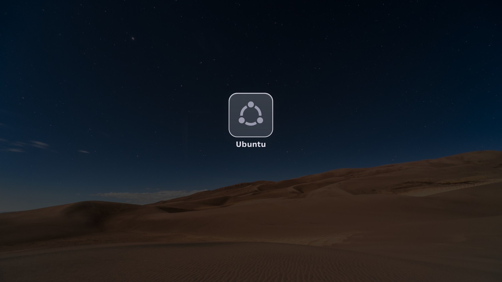

# How it works

The boot menu is rEFInd 0.14.2 with `patches/frosted-glass.patch` applied. This
file is what the patch does and why, written down while it was being worked out.
[README.md](README.md) is what it looks like and how to install it,
[USAGE.md](USAGE.md) is how to drive it.

## Why not GRUB

This theme started as a GRUB theme and had to be abandoned. The reason is worth
recording, because it is not obvious.

GRUB's `gfxmenu` is entirely software-rendered. Every repaint is written by the
CPU into the firmware's framebuffer across the PCIe bus, with no acceleration.
At 3840×2160 that is 8.3 million pixels, 31.6 MB, per full repaint: four times
the cost of 1080p.

The slowness was the smaller problem. While GRUB is busy repainting it is not
reading the keyboard, so the firmware's key auto-repeat keeps firing and the
events queue up. One press of the arrow key moved the selection *two* entries.
Lowering the resolution fixed it, which is what proved the cause.

rEFInd avoids this through one architectural difference, visible in
`refind/menu.c`:

```c
static VOID DrawMainMenuEntry(REFIT_MENU_ENTRY *Entry, BOOLEAN selected,
                              UINTN XPos, UINTN YPos) {
    Background = egCropImage(GlobalConfig.ScreenBackground, XPos, YPos, ...);
```

On a selection change it crops and repaints just the affected tile, so the cost
of moving the selection does not grow with the screen area.

## Checking that a 4K photograph is really 4K

Two of the photographs in the library had 4K of pixels and nowhere near 4K of
picture. It does not show in a thumbnail. It shows at 1:1, and it shows in
numbers. `check-photos.py` measures four:

| | |
|---|---|
| **noise** | Immerkær's estimator: a kernel whose response is zero for anything smooth, so what survives it is noise |
| **chroma** | the same on the colour-difference planes. Colour noise is the objectionable kind, and a luminance measure walks straight past it |
| **mottling** | average to 8×8, subtract the large-scale trend, measure the rest. A sky's gradient disappears; blotching does not |
| **sharpness** | where the radial power spectrum meets the noise floor, against what 3840 pixels could carry |

`morning-light-on-dunes` came out at noise 7.15, eight times everything else,
and sharpness 35%: four thousand pixels across, thirteen hundred of picture.
`snowy-dunes-in-moonlight` measured clean on the first pass and was visibly
blotchy at 1:1, which is what the chroma and mottling measures were added for.
Both are gone.

Everything is measured on the picture *as it will be used*, cropped to 16:9 and
resampled to 3840×2160, because that is where the noise ends up, not where it
started. Point it at your own photographs before adding them.

## The accent colour, read from the photograph

Everything on the screen is drawn in a hue read out of the picture behind it:
the glass, the logos, the names under them, the tool glyphs, the line of text at
the bottom, the dots of the spinner. No colour appears that the photograph does
not contain, and none of it is written down anywhere. Point it at a photo of
your own and it works out its own palette.

Averaging colour is where this usually goes wrong. A plain mean of the pixels
turns to grey, because opposite hues cancel. The usual repair is to treat each
hue as a point on a circle and average those, which needs a sine and a cosine
per pixel. A bootloader has neither, so the same answer has to be reached
without them.

It can be, and more simply. Every colour is a grey plus a departure from grey;
that departure is a vector in the plane at right angles to the grey axis; and
averaging those vectors is the circular mean, written in linear coordinates. So
`accent()` sums `(r,g,b)` minus its own mean, weighted, and the direction of
what is left is the picture's hue. No trigonometry anywhere. The preview and the
bootloader run the same arithmetic: `build.py`'s `accent()` is a transcription
of `SampleAccent()` in `refind/theme.c`, integer for integer. They were once two
different formulations, HSV here and vectors there, and they drifted twenty-four
levels apart, so the preview showed a colour the machine would not draw.

The weight is where the judgement lives. It counts how colourful a pixel is, and
how bright: brightness cubed. With brightness counting once, a vast dark dune
outvotes the small bright sky the eye actually reads the picture by. The default
photograph came out at hue 341°, a pink, when its sky is at 13° and the picture
is plainly warm. Cubed, it lands on 18°.

Every colour in the theme is then a saturation and a lightness away from that
hue, and the saturations are deliberately small: around 0.09, which reads as
warmth rather than as a colour. The aim is a warm grey that belongs to the
photograph.


None of this is written down per photograph. `library-preview.py` renders the
menu against every picture in the library, and each of those hues is what the
picture itself yielded, measured on the photograph in the state the menu will
use it, dimmed and softened, and not on the file as it came off Commons. Three
warm deserts come out at 14°, 18° and 23°, three night skies at 210°, 210° and
227°, and a photograph of your own gets whatever it happens to contain.

A logo washed over with that colour would flatten it. Instead its own lightness
picks a point on a ramp between a dark and a light version of the hue, so the
shape and its internal contrast survive while the hue becomes the picture's.

A straight ramp is what makes this look faded, and it is worth knowing why. A
line drawn between a dark colour and a light one passes through their average,
which is close to grey, so chroma is at its weakest exactly halfway along, and
halfway along is where a logo sits. The Windows blue lands at 0.60 of the way up
the ramp and came out at a saturation of 0.17. The ramp's chroma now peaks in
the middle instead:

```python
sat = peak * (1 - abs(2 * t - 1) ** bulge)
```

which keeps the hue at the logo's own lightness instead of losing it there. That
stops a near-neutral palette going flat: the tint is small everywhere, and it
does not disappear in the one place the eye is looking.

Each part has a floor as well as a ceiling. Scaling saturation purely in
proportion to the photograph's leaves a muted picture indistinguishable from
grey, and a vivid one shouting. A photograph at 68% saturation gives a logo at
0.17 and a border at 0.14, still a tint and not a colour scheme. The values in
`TONE` were chosen by rendering the menu at three strengths and looking. Weaker,
and the panel's border is indistinguishable from white, which gives the game
away: the border and the raking veil are the parts of the glass you actually
see, and tinting only the fill underneath them changes nothing. Stronger, and it
reads as a pink theme instead of a theme belonging to the photograph.

`tint 0` in `theme.conf` puts Windows back to blue and Ubuntu back to orange,
and the settings screen in the boot menu steps it in quarters.

## The sub-menus

rEFInd's own sub-menus are a flat grey rectangle with a line of text in it.
Correct, and nothing like the rest of this. There is one style function now, and
every sub-menu goes through it: settings, about, hidden tags, the boot-options
screens. Each is a pane of the same glass the tiles are made of, with the
photograph frosted behind a rounded shape, a lit rim, the theme's own colours,
and the selected row on a rounded bar whose highlight fades across instead of
snapping.

The whole panel is composed into one image and put up in a single blit. Drawing
a menu in pieces is what makes it flicker.

Two things worth knowing, since both looked like taste and were arithmetic.
Rounded corners are sampled in eighths of a pixel, so the square of the corner
radius is `64·r²`; using `16·r²` gives a corner of half the size and a rectangle
with the corners bitten out of it. `InitScroll()` works out how many entries fit
from the width of a menu tile, which is right for the main menu and gives five
for a list of text, so the sixth row of a six-row menu was simply not drawn. A
panel of lines is bounded by the height of a line.

## Animation


The menu rises out of the photograph a tile at a time. Moving the selection
fades the highlight across to the new row. Choosing something dissolves the rest
of the menu and sends that tile travelling to the middle, where the ring picks
up.

Three things make that affordable at 3840×2160. A tile is 617×617, a
twenty-second of the screen, so only what changes is touched. The frost behind a
tile depends on where the tile is and not on which frame it is, so it is
computed once per position instead of once per frame. And both ends of a
cross-fade are composed in memory: moving the selection costs the same two
blurs it always did, and reads nothing back off the framebuffer, which is quick
to write and slow to read.

None of it is allowed to get in the way. Every loop stops the instant a
keystroke is waiting:

```c
static BOOLEAN KeyIsWaiting(VOID) {
    return (refit_call1_wrapper(BS->CheckEvent, ST->ConIn->WaitForKey) == EFI_SUCCESS);
}
```

so browsing slowly is smooth and holding an arrow key is exactly as fast as it
was before any of this existed. `animations false` turns the lot off.

`animation-preview.py` renders all of it to a GIF using the same integer easing
`menu.c` uses (0..256, cubic, no floating point), so timing can be looked at
without building a bootloader.

### What it costs to draw

At 3840x2160 a single screen is 8.3 million pixels, 33 MB through the
framebuffer. A wipe from the top of the screen to the bottom is what one of
those looks like when the firmware is doing the copying. Nobody chose it as an
effect. So the count is instrumented: `BltImage()` was made to total the pixels
it pushes, and the totals logged at each step of a 4K boot in the virtual
machine.

| | before | after |
|---|---|---|
| painting the first screen | 8 blits, 66 Mpx | 1 blit, 8 Mpx |
| everything up to the drawn menu | 171 blits, 88 Mpx | 164 blits, 30 Mpx |
| the fade on the way out | 23 Mpx | 4 Mpx |

Four things account for it.

The screen is painted once. `SetupScreen()` used to paint the background before
the theme knew which photograph it was or what colour anything on it should be,
so the picture went up, then went up again. It now marks the screen dirty and
leaves it black; `main.c` paints after the scans, once.

The full-screen cross-fade is off by default (`fade`). It is eight whole screens
before the menu is even there, and it produces the slow wipe it was supposed to
hide. The tiles still fade themselves in, and that is the part you watch.

Pixels that did not change are not sent. The dissolve on the way to a system
used to fade the whole 3840-wide band the menu lives in. It now compares that
band against the background once and fades only the box the drawn content
occupies, 972x661 out of 3840x841, a fifth of it. The picture is the same,
because every pixel outside that box already *is* the background.

Nothing is frosted twice. A blur of a 549-pixel plate is the single most
expensive thing here, so the tiles keep the last twelve in a cache keyed on
position, and the settings panel keeps its glass. Moving the highlight one row
used to re-blur 1.26 million pixels to draw a bar 40 pixels tall.

Underneath all of it, `egDirectDraw()` and `egDirectRead()` move rows straight
in and out of `GraphicsOutput->Mode->FrameBufferBase` when the mode is 32-bit
BGRX; anything else falls back to the firmware's own `Blt`. The firmware call is
a general-purpose routine that copes with any pixel format. When the format is
already the one `EG_IMAGE` uses, a row is a copy and the firmware is not
involved at all.

### gnu-efi's memcpy

One thing mattered more than all of that. This is gnu-efi's `memcpy()`, which is
where every `CopyMem()` in the program ends up:

```
2f0:  movzbl (%rsi,%rax,1),%ecx     load one byte
2f4:  mov    %cl,(%rdi,%rax,1)      store one byte
2f7:  add    $0x1,%rax
2fb:  cmp    %rdx,%rax
2fe:  jne    2f0
```

One byte per iteration. Against ordinary memory that is eleven times slower than
it needs to be: 9.9 ms against 0.9 ms for 33 MB, measured on the machine this
was written on. Against a framebuffer it is far worse than eleven times, because
a framebuffer is not ordinary memory. Every store leaves the processor for the
graphics card, and one byte per journey is 33 million journeys to put up a
single 3840x2160 screen. That wipe from the top of the screen to the bottom is a
byte-at-a-time loop.

`egCopyWide()` moves eight bytes per store, four when the addresses are not
eight-aligned; pixels always are four. rEFInd is built with
`-fno-tree-loop-distribute-patterns`, so the compiler leaves the loop alone
instead of turning it back into the `memcpy()` it came from.

Above that sits the memory type itself. Most firmwares leave the framebuffer
uncacheable, which is what makes each of those journeys expensive in the first
place. Write-combining is the type framebuffers are meant to have, and every
operating system sets it on the same memory the moment it takes over.
`egSpeedUpFrameBuffer()` asks the CPU architectural protocol for it once, at the
resolution it settles on. If the firmware has no such protocol or refuses (OVMF
answers "Out of Resources", having spent its registers already) nothing changes
and nothing breaks.

### The shadow copy of the screen

A framebuffer is quick to write and desperately slow to read. A write is posted
and forgotten; a read is a round trip to the card that nothing can buffer. And
the code read from it constantly without anybody noticing: `BltClearScreen()`
ends with `egCopyScreen()`, a whole screen back off the card on every repaint,
and the cross-fade on the way to an operating system began by reading back the
band the menu lives in, thirteen megabytes, before it could draw its first
frame. That read is the pause between pressing Enter and seeing anything happen.

So the screen is mirrored in ordinary memory: every write goes through
`egShadowNote()` as well as to the card, and `egCopyScreenArea()` reads the
mirror. The mirror costs one copy at memory speed, which is beneath noticing,
and it holds exactly what was drawn, which is what the reader wanted to know. It
is trusted only once a whole screen has passed through it, and dropped whenever
something else might have drawn: text mode, or a program rEFInd launched and
came back from.

All of that was written, measured in the virtual machine, and did nothing at all
on the machine it was for. Both it and the fast write had been put inside
`egDrawImageArea()`, and `egDrawImageArea()` had no callers. Everything rEFInd
draws goes through `egDrawImage()`, which called the firmware's `Blt` directly.
Two rounds of optimisation had been sitting in a function the program never
reached.

The log from the machine itself is what found it. Every full-screen paint landed
at ~2970 ms after the keypress and the handoff took 1480 ms to draw its first
frame; 33 MB against 2.97 s and 14 MB against 1.48 s come to the same number
both times, 11 MB/s. That is a framebuffer being read, not a program being slow.
`egDrawImage()` now goes through `egDrawImageArea()` like everything else. The
same machine, the same log, the next boot:

| from the keypress to | before | after |
|---|---|---|
| the handoff ready to draw | 1480 ms | 8 ms |
| the menu faded out | 1774 ms | 301 ms |
| the splash finished | 4033 ms | 2560 ms |

The 301 ms is the fade-out itself, which is 280 ms by design, and 2560 is
280 + 450 + 1800: the dissolve, the tile's travel and one turn of the ring.
There is nothing left in there that is not the animation.

### Redrawing after a settings change

Changing a setting means reading a photograph off the EFI partition, decoding
eight million pixels of JPEG and dimming all of them. Doing that before drawing
anything leaves the screen still from the keypress until the work is finished,
which reads as the machine having missed the key.

So the panel goes up first, with the new value already in it, and the photograph
follows when it is ready. The work itself is only done when it is needed:
toggling animations changes nothing on the screen, saving to disk changes
nothing on the screen, and only a new photograph or a new dimming needs the
whole screen back. The other rows repaint a pane, not eight million pixels.

### Timing by the clock

An animation used to be counted in frames: draw one, wait 10 ms, draw the next.
That is the same thing as time only on a machine where drawing is free, and on
the machine above a frame could take longer to appear than the pause after it.
Counting frames there stretches every animation to half the speed and twice the
length, which is what "laggy" means.

So the animations ask the processor what time it is, through `rdtsc` calibrated
once against a stall of known length, and each one runs for the duration it is
meant to take: a slow display draws fewer frames, a fast one draws more, and
both finish at the same moment.

That change came with a lesson attached. The old numbers were frame counts, and
they had never been durations at all. The time to draw a frame was hidden inside
each one, so the menu that "took 180 ms" had really been taking a second and a
half on the machine it was written for. Run by the clock, 180 ms of arrival
reads as no arrival: the animations looked deleted. The durations are now stated
outright. A tile begins its fade 40 ms after the one to its left and takes
360 ms over it, the selection moves in 170, the menu dissolves in 280 and the
chosen tile travels for 450. The frame counts are only the resolution of the
easing curve.

None of which is worth guessing at, so `log_level 1` makes each step say how
long after the keypress it happened, into the log on the EFI partition. A
machine that feels slow can be asked where the time went.

None of this trades quality for speed. Every image is still composed at full
resolution, the blur radius is unchanged, and the animations last exactly as
long as they were designed to; there is simply less repetition of work already
done.

## The handoff splash

Pick anything and rEFInd shows it on its own before handing over: the tile the
menu drew, with a ring of dots turning underneath, then a black screen for
whatever comes next. The screen is the same whatever was chosen.


Plymouth cannot do this. It lives inside Ubuntu's initramfs and runs only when
Ubuntu is what you picked, so it can never be the boot logo of Windows, or of a
stick plugged in this morning. rEFInd is the one thing that runs before every
one of them, and it
already holds the icon for each entry it found, logo, name and all. So the
splash lives there, and a system nobody has installed yet already has its boot
logo, correct on the first boot, without being told anything.

The tile holds its contents high. The panel sits high inside the icon with the
name beneath it and the ring hangs below that again, so putting the tile in the
middle of the screen leaves what you actually look at 195 px low. Centring is
done on the group instead: the top of the panel is read from the icon's own
alpha channel and the whole group shifted until that span is centred. That stays
right for an icon with a longer name, or with none at all. rEFInd and Plymouth
compute it the same way and land on the same pixel.

`handoff_splash` is how long it stays, in milliseconds; 1800 is one full turn of
the ring, and 0 switches it off. It is the last thing drawn before the screen
goes black, so it does not collide with the logo Windows draws next.

rEFInd is an EFI application and never sets up the FPU, so none of this is
floating point. Angles are 4096ths of a turn and sines are 4096ths of one, read
from a 65-entry quarter-wave table with linear interpolation. Against the
double-precision version the dots land within 0.78 px on a 70 px radius. The two
animations are the same animation, and Plymouth is the next thing to draw it.

The ring is 140 px across at 3840x2160: 6.5% of the height, roughly what Windows
draws. It began at 10%, which looks like a hoop. Both numbers live twice, in
`menu.c` and in `plymouth.py`, and they have to agree: the ring the boot menu
turns and the ring the system turns after it are meant to be one ring that never
stops.

## The splash carries on from the menu


Pick Ubuntu and the menu does not disappear. The same photograph stays, with the
tile you chose still on it, and a ring of dots turns underneath while the system
comes up: the ring rEFInd was already turning, continued at the same size, the
same speed and the same easing. `./plymouth.py` builds it, `sudo ./setup.sh`
installs it.


What the boot menu needed a patched bootloader for is free here. A panel drawn
into a rEFInd icon cannot blur what is behind it because it does not know where
it will end up; a Plymouth background never moves and neither does the panel, so
the frost is composited once, when the theme is built, into `background.png`.
Decoding 3840×2160 costs 85 ms, once.

The dots are the only thing that moves, and they are the only thing the script
computes. Each one walks the same eased path a little later than the one before,
so they gather where the path is slow and string out where it is fast. The four
numbers that govern it are not free: the dots span
`2π·g'(p)·(NDOTS−1)·STAGGER` of the circle and `g'` runs between `1−SWING` and
`1+SWING`, so the arc closes to 81° and opens to 279°. At its tightest that is
99px of arc holding 78px of dots, so they gather without ever colliding.

The theme picks its icon from `/etc/os-release`, so it shows the logo and the
name of whatever it was built on, and it is generated from the same geometry as
the boot menu: the tile lands on exactly the pixel it would have occupied there.

### Asking the EFI partition what changed

The menu changes its photograph from its own settings screen, with no operating
system running. The splash is an initramfs built weeks earlier. There is no way
for the first to tell the second, so the second asks: `refind-frosted-4k-theme-maintain` reads
`theme.conf` off the EFI partition once per boot, compares it with what the
installed theme was built from, and rebuilds only when they differ. Nearly every
boot it finds nothing to do and stops in a few milliseconds; when the photograph
has changed it takes about sixteen seconds at idle priority, after the desktop
is already up, and the splash matches from the next boot.

The size is asked for the same way. Plymouth scales its background to the screen
with a two-tap filter at draw time, and reducing a 4K image to a smaller panel
that way is what made the splash look grainy while the same photograph looked
clean in the menu: the menu is drawn at the size it is shown. So the theme is
composed at 3840×2160, the size everything here is drawn at, and then brought to
the resolution the machine actually boots at with Lanczos, before it is ever put
in an initramfs. Plymouth then scales nothing.

Nothing in the installer assumes Debian. The initramfs is rebuilt with whichever
of initramfs-tools and dracut is there, the theme is selected through
`update-alternatives` or `plymouth-set-default-theme`, and the fonts are
searched for. Install Fedora tomorrow, run the same script inside it, and it
gets this splash carrying Fedora's logo and Fedora's name over the same
photograph. The logo and the name come from that system's `os-release`, and the
photograph comes from the EFI partition both of them share. The boot menu itself
needs none of that: it already draws the right icon, name and ring for anything
it can boot, including a system installed next year. What the installer buys is
the seconds *after* the handover, which belong to the system being booted and
can only be arranged from inside it.

### Windows

Every other system can be given a splash by installing something inside it.
Windows cannot: there is no initramfs to put a theme in. Windows does not choose
the picture it shows while it starts, though. It reads one out of an ACPI table
called BGRT, the Boot Graphics Resource Table, which the firmware fills in with
the manufacturer's logo. That is why a laptop shows its own badge during a
Windows boot and not a Windows one.

A bootloader is the last thing to run before the operating system, so it is the
last thing that can write to that table. `bgrt.c` finds it through the root
pointer in the EFI configuration table, writes the screen there as a full-screen
24-bit bitmap in boot-services memory (where firmware puts its own, and the only
kind Linux will accept), and reseals the table's checksum. Nothing is installed
inside Windows, nothing has to survive Windows being reinstalled, and there is
nothing there to break.

The picture is taken with the tile in place and *before* the ring starts,
because Windows draws its own ring of dots underneath and cannot be asked not
to. One ring is better than two, even when the one you keep is Windows'.

It is testable without booting Windows at all, which is as far as the testing
here has gone. Linux reads the same table, so after a Linux boot
`/sys/firmware/acpi/bgrt/status` is 1, the type is 0, the offsets are 0,0 and
`/sys/firmware/acpi/bgrt/image` is exactly the bitmap that was handed over. That
proves the table is well formed and that an operating system accepts it. It does
not prove Windows draws it; nobody has booted Windows to look. HackBGRT has been
doing the same thing to the same table for years and asks for the same 24-bit
BMP with a 54-byte header, which is the reason to expect it works.

This is that file, read back off a running system:



Two attempts were needed and the machine explained both. The first put the
bitmap in memory that is never reclaimed, reasoning that it had to survive into
a running kernel; Linux answered `Ignoring BGRT: invalid image address`, because
it accepts the image only from `EFI_BOOT_SERVICES_DATA` (where firmware puts its
own) and reserves those pages itself once it has. The second was accepted but
would not open: `Unsupported BMP compression`, because the header was right in
every field this code wrote and garbage in every field it did not. The zeros had
been left to `SetMem()` and did not arrive. Why has never been established;
writing all fifty-four bytes on purpose is cheaper than finding out, and leaves
nothing to depend on.

## Design notes

The screen is painted once. rEFInd used to paint the whole screen three times
before the menu appeared: the banner in `SetupScreen()`, a clear to black, and
the banner again after the scan. At 3840×2160 each of those is a third of a
second of visible wiping, so what you saw was a wipe, a pause, a black flash and
another wipe. The screen now stays black until the theme knows what it is
drawing. The picture comes up once, out of the black, and goes back down into it
on the way to an operating system.

The clear before the banner is gone too. It only ever wrote a screenful of one
colour underneath a screenful of picture.

The screenshots are rendered by the layout code itself. `make-screenshots.py`
calls the same `preview()` that `build.py` uses, which walks rEFInd's own
arithmetic for the row positions and runs the same blur the patched binary runs
at draw time.

That holds only where the preview uses the *same artefacts*, and for a while it
did not: it drew the bottom line of text with a font of its own, at a hardcoded
grey. The theme's colours moved and the screenshot did not, so the line looked
grey in a picture of a menu that draws it warm. It now loads `font.png` and
applies rEFInd's own rule from `libeg/text.c` (glyphs inverted, r, g and b but
not alpha, on a background darker than 128), so the colour is chosen in one
place.

Names are baked into the icons. rEFInd's own label mechanism prints one line at
the bottom of the screen in the fixed form *"Boot X from Y"* (see *Gotchas*),
which is useful for identifying a stick but too long to sit under a tile. Baking
the name into the icon gives each entry a short label that travels with it.

Nothing hand-drawn is ever upscaled. Every asset is drawn larger than it is used
and left for rEFInd to shrink. Downscaling stays sharp; upscaling does not.

## Geometry

`build.py` recomputes every number below from rEFInd's own arithmetic; none of
them is stored. Before it writes anything it checks one condition: that at least
two OS tiles still fit across the screen. Below that, rEFInd starts scrolling the
OS row.

The values in the table are for 3840×2160, the size everything is stated at.
`build.py --size WxH` restates them for another screen, and the installer passes
it whatever the machine reports. At 3840×2160 the tile is 617, the frost radius
14 and the font cell 27×52. At 1920×1080 those become 308, 7 and 14×27, and five
entries still fit across, because the scaling is arranged to preserve that
count. `TILE_XSPACING` is the
exception: it is `#define`d in rEFInd's own source, so 8 px is 8 px on every
screen.

| Quantity | Formula (`refind/menu.c`) | Value |
|---|---|---|
| `TileSizes[0]` | `big_icon_size * 9 / 8` | 617 |
| `TileSizes[1]` | `small_icon_size * 4 / 3` | 64 |
| `row0PosY` | `UGAHeight/2 - TileSizes[0]/2` | 772 |
| `row0PosX` | `(W + 8 - (TileSizes[0]+8)*2) / 2` | 1299 |
| `row1PosY` | `row0PosY + TileSizes[0] + 16` | 1405 |
| `textPosY` | `row1PosY + TileSizes[1] + 16` | 1485 |
| Tile centres | n/a | 1607, 2232 |

`big_icon_size = 549` is forced by the layout. The OS row is always centred
vertically and the tool row hangs off it, so inflating the OS tile is the only
way to get the tool row below the baked labels instead of on top of them. 549 is
the smallest value that puts the tool row clear of them. The logos stay 218 px
because they are drawn inside mostly-transparent 549 px canvases. The tile is a
bounding box and not the artwork.

Two hard limits constrain it:

- `MaxVisible = UGAWidth / (TileSizes[0] + 8) - 1` must stay ≥ 2, otherwise
  rEFInd shows one OS icon at a time with scrolling. That caps
  `big_icon_size` at 1130.
- `TILE_XSPACING` is `#define`d to 8 px. Tiles always touch; visual separation
  has to come from transparent margins inside the artwork.

## Gotchas

Everything here was found by reading rEFInd's source after the obvious
explanation turned out to be wrong.

**1. The font is inverted on dark backgrounds.** `libeg/text.c`:

```c
if (BGBrightness < 128) {
   LightFontImage->PixelData[i].r = 255 - LightFontImage->PixelData[i].r;
```

rEFInd expects black glyphs and inverts them itself. Supply white glyphs and
you get black, unreadable text. `build.py` draws them at 95 so they render at
160, a soft grey.

**2. A discovered entry is labelled with its own path.** `scan.c`, in
`AddLoaderEntry()`:

```c
Entry->Title = StrDuplicate((LoaderTitle != NULL) ? LoaderTitle : LoaderPath);
```

An automatically discovered loader arrives with no title, so it is named after
the file it is: *"Boot EFI\ubuntu\grubx64.efi from &lt;volume&gt;"*. rEFInd
already knows better than that. `SetLoaderDefaults()` takes
`FindLastDirName(LoaderPath)` as its first icon hint, which is why that entry
gets the Ubuntu logo. The patch reads the same hint for the label, so an entry
is named for its system. It also drops the *"from &lt;volume&gt;"* suffix when
the loader is on the ESP rEFInd itself booted from, where that suffix is on
every entry and tells none of them apart. A USB stick keeps its suffix; there
it says something.

Renaming the ESP's GPT partition is *not* the fix, however tempting: it writes
one machine's name into the partition table and every other machine that ever
sees the disk reads it.

**3. `hideui label` also hides the countdown.** Both live behind the same guard,
so hiding the long titles also removes *"Booting in N seconds"*. Raise `timeout`
to compensate.

**4. The fallback boot loader comes back as a third entry.** `EFI\BOOT\bootx64.efi`
is usually a byte-for-byte copy of `shimx64.efi`, and `shimx64.efi` is in
rEFInd's default `dont_scan_files`. `ScanLoaderDir()` skips it, and skips it
*before* reaching its own `DuplicatesFallback()` test, which only ever sees files
that were accepted:

```c
FilenameIn(Volume, Path, DirEntry->FileName, GlobalConfig.DontScanFiles) ||
!IsValidLoader(Volume->RootDir, FullName)) {
      continue;   // skip this
}
```

So rEFInd refuses to list a program and then offers a byte-identical copy of it
as *"Fallback boot loader"*. The patch runs the duplicate test where the refusal
happens. A USB stick, whose `EFI/BOOT/bootx64.efi` has no twin beside it, is
unaffected; that is how a bootable stick boots.

**5. MokManager is offered with Secure Boot switched off.** rEFInd shows the MOK
utility whenever it finds `mmx64.efi` on the ESP, and Ubuntu's shim always
installs one. But MokManager enrols keys into the database Shim consults, and
Shim consults it only under Secure Boot, so with Secure Boot off the key icon
in the tool row leads nowhere. The patch makes the tool conditional on
`secure_mode()`, so it appears exactly when it can do something.

**6. rEFInd hands the next OS a screen painted one colour from your wallpaper.**
`BeginExternalScreen()` calls `BltClearScreen(FALSE)`, which fills the screen
with `MenuBackgroundPixel`:

```c
MenuBackgroundPixel = Banner->PixelData[0];
```

That is the top-left pixel of the background image. A sensible colour to extend
a banner with, and a terrible one to leave behind: a boot loader that draws its
own logo draws it over whatever is in the framebuffer and never clears first.
Windows does exactly that, so one pixel from the corner of a photograph becomes
the background of the Windows 11 boot animation, spinner and all. Every OS's
boot graphics is designed against black; the patch gives it black.

**7. Icons are upscaled without warning.** `big_icon_size 256` against a 128 px
icon file silently doubles it and it looks soft. Always ship art at or above the
configured size.

**8. On Ubuntu, `recordfail` overrides `GRUB_TIMEOUT`.** If GRUB is chainloaded as
a silent pass-through, an interrupted boot leaves `recordfail=1` in `grubenv`
and `/etc/grub.d/00_header` then forces a 30-second visible menu. Set
`GRUB_RECORDFAIL_TIMEOUT=0`.

**9. A loop that never ends on a negative number.** `SquareRoot()` starts with a
bit above the answer and shifts down:

```c
INTN r = 0, b = 1 << 20;
while (b > n) b >>= 2;
```

On a negative `n` that shifts `b` to zero, where `0 > n` is still true and the
shift is still zero. The bootloader drew the background and then hung before the
menu. The `n` went negative because sixty thousand weighted samples squared past
what a 64-bit integer holds. Both the guard and the normalisation are fixed, and
`test-vm.sh` exists because of it: it found this in one run, where a reboot and a
guess had found nothing.

**10. rEFInd's Makefile does not track header dependencies.** There is no `-MMD`
anywhere in it, so editing a header and running `make` rebuilds nothing that
included it. Add a field to `REFIT_CONFIG` in `global.h`, rebuild without
cleaning, and `config.c` gets the new layout while `main.c`, which *defines*
`GlobalConfig`, keeps the old one. The binary then reserves 16 bytes too few and
the parser writes past the end of the object, in a bootloader. It is invisible:
the fields were appended, so every existing offset still lines up and everything
appears to work.

What it looks like, if you go looking:

```
$ nm -S --defined-only refind/refind_x64.so | grep GlobalConfig
00000000000326e0 0000000000000250 D GlobalConfig     # incremental
00000000000326e0 0000000000000260 D GlobalConfig     # after make clean
```

`build-refind.sh` runs `make clean` every time for this reason. It was caught by
diffing a binary built from a patched pristine tree against the installed one and
chasing the one byte that was not the PE timestamp.

**11. Config paths have two different bases.** `banner`, `font` and `selection_*`
are relative to the directory holding `refind_x64.efi`; `icon` inside a
`menuentry` is absolute from the ESP root. Mixing them up fails silently: the
file is never loaded.

