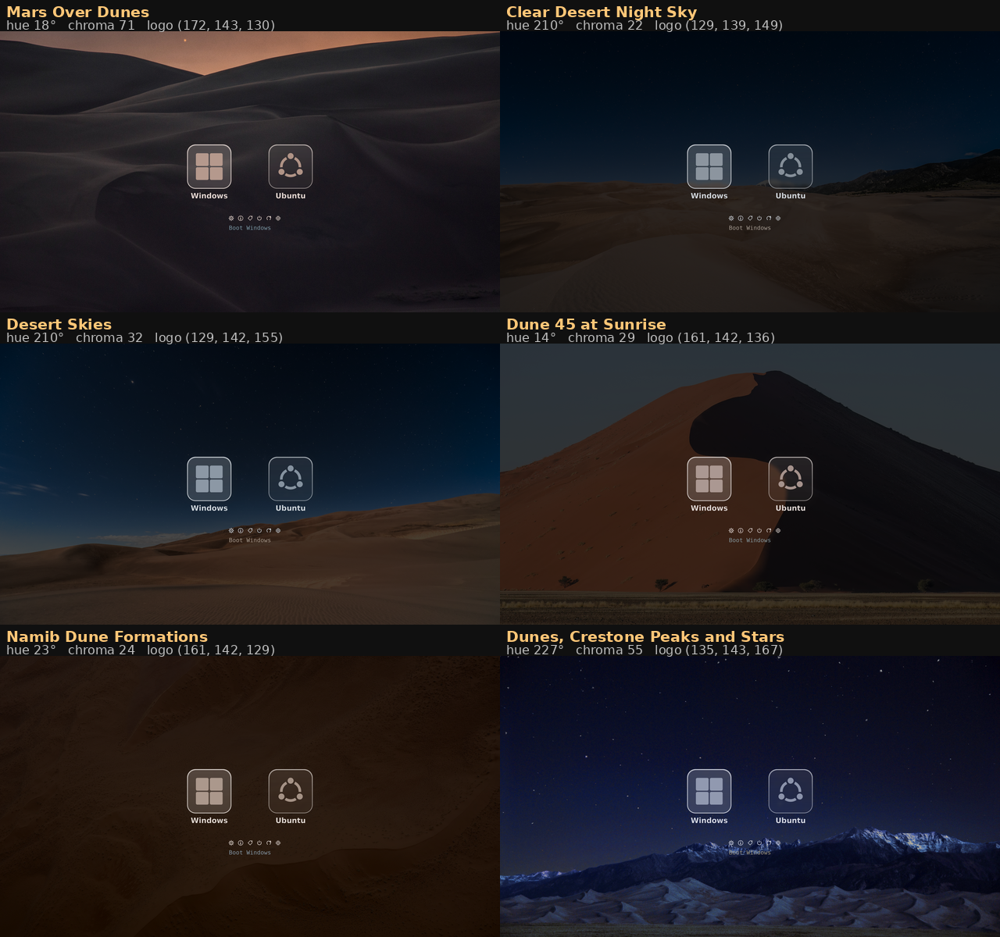
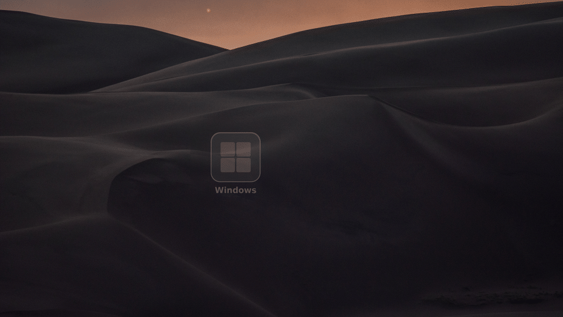
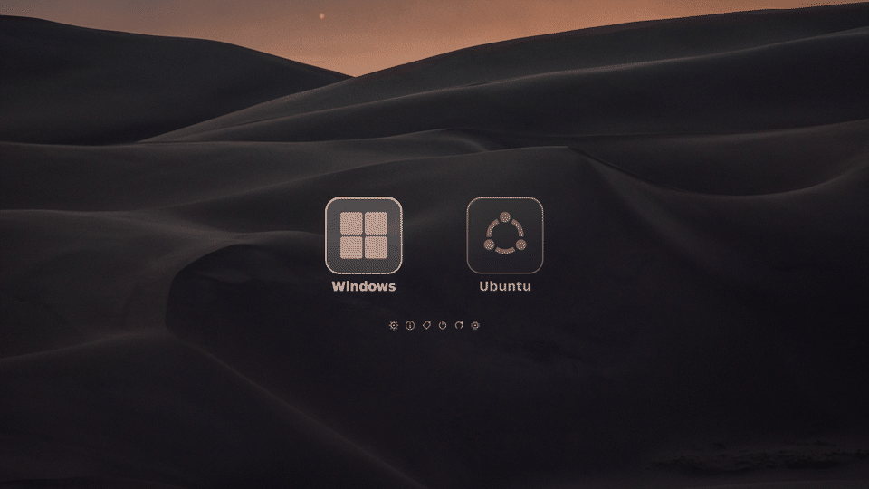
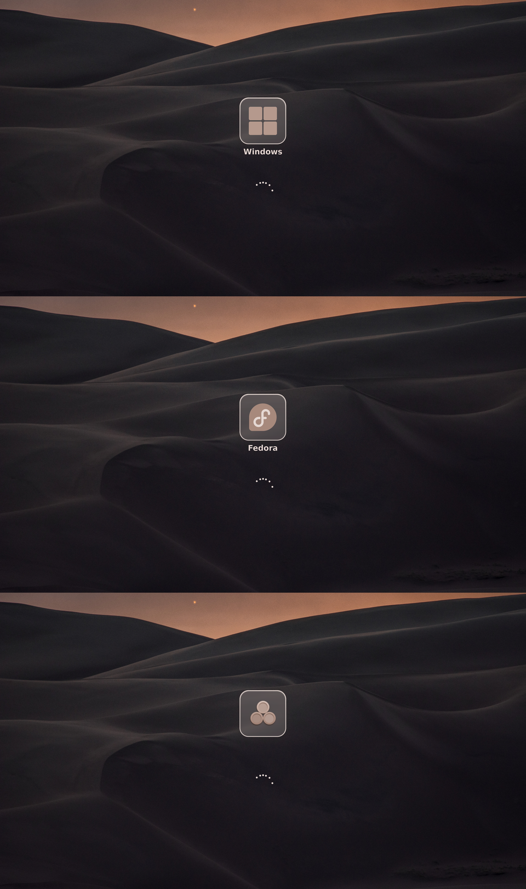
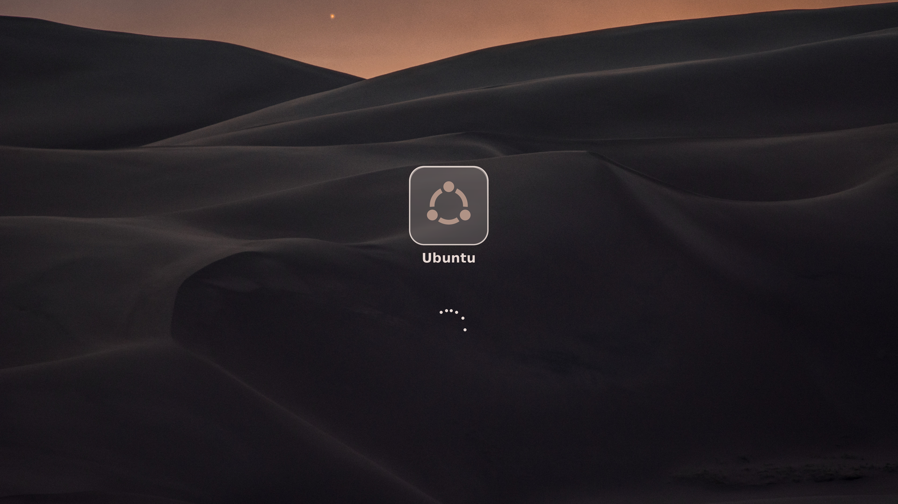
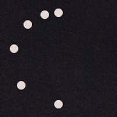

# refind-frosted — a 4K boot menu

A theme for [rEFInd](https://www.rodsbooks.com/refind/) built for **3840×2160**,
which is the whole reason it exists: at that resolution GRUB's software renderer
falls apart, and every asset here is drawn at native size so nothing is ever
scaled up.

Frosted-glass tiles, labels, icons and the bitmap font are all generated by a
script from a single background photograph, at 4K, so the look can be rebuilt
around any photo you like without losing sharpness.

Built for a Windows 11 / Ubuntu dual boot; the two menu entries are ordinary
rEFInd stanzas and can point anywhere.


> **[USAGE.md](USAGE.md)** — how to change the background, use your own photo,
> and adjust the dimming.

> The images in this README are **renders**, not photographs: they are produced by
> `build.py` from the exact same asset files and rEFInd's own layout arithmetic, so
> they are pixel-faithful to what the firmware draws. Photographing a boot screen
> gives a worse picture than the maths does.

---

## Why not GRUB

This theme started as a GRUB theme and had to be abandoned. The reason is
worth recording, because it is not obvious.

GRUB's `gfxmenu` is **entirely software-rendered**. Every repaint is written by
the CPU into the firmware's framebuffer across the PCIe bus, with no
acceleration. At 3840×2160 that is 8.3 million pixels — 31.6 MB — per full
repaint, four times the cost of 1080p.

The visible symptom was not just sluggishness. While GRUB is busy repainting it
is **not reading the keyboard**, so the firmware's key auto-repeat keeps firing
and the events queue up. One press of the arrow key moved the selection *two*
entries. Lowering the resolution fixed it, which is what proved the cause.

rEFInd does not have this problem because of a single architectural difference,
visible in `refind/menu.c`:

```c
static VOID DrawMainMenuEntry(REFIT_MENU_ENTRY *Entry, BOOLEAN selected,
                              UINTN XPos, UINTN YPos) {
    Background = egCropImage(GlobalConfig.ScreenBackground, XPos, YPos, ...);
```

On a selection change it crops and repaints **only the affected tile**, not the
screen, so the cost of moving the selection does not grow with the screen area.

---

## It adapts

`scanfor internal,external,optical,manual` — rEFInd discovers what is actually
attached, every boot. Plug in a bootable USB stick and it appears. Install
another system next year and it appears. Nothing here needs editing.


Two things make that work.

**The glass is blurred by rEFInd itself, at draw time.** A panel painted into
an icon cannot blur what is behind it — the icon is generated long before anyone
knows where it will be drawn. But rEFInd already crops the background to the
exact tile before painting an entry:

```c
Background = egCropImage(GlobalConfig.ScreenBackground, XPos, YPos, W, H);
```

so the blur belongs there. `patches/frosted-glass.patch` adds `egFrostImage()`,
which blurs that crop wherever a stencil says there is glass, and the tokens
`frost_radius` and `frost_mask_big` to control it. `./build-refind.sh --install`
builds and installs it. Without the patched binary the theme still works; the
plates are simply translucent rather than frosted.

The stencil matters more than it sounds. Blending the blur in proportion to the
*panel's* alpha is the obvious thing to do and it is wrong: the panel is 25%
opaque, so the background comes out a quarter blurred and three quarters sharp,
which reads as a slightly soft photograph and not as glass at all. Real frosted
glass scatters everything that passes through it — behind the pane the view is
*fully* blurred, and the pane's tint is laid over that afterwards. So the
stencil's alpha says **where** the glass is, never how transparent it is, and
the tint arrives with the icon that is composited next. Measured on a
detailed photograph, `detail` inside the panel falls from 8.53 to 1.86 while
one pixel outside it stays at 7.97, unchanged.

**What makes it read as glass is not the blur.** On a dark, smooth photograph
there is nothing behind the pane to soften, so the frost has nothing to show;
and a drop shadow cannot darken a background that is already almost black. Both
of the obvious cues do nothing there. What does the work is light *on* the
surface — a hairline just inside the top edge where a bevel would catch it, and
a rim that stays crisp instead of fading out — neither of which depends on what
is behind at all. Those, with the pane's own body taken down from 36 to 24 so
the edge has something to stand against, are the difference between a pane and a
rounded rectangle. The blur still matters, but only on a photograph with
something in it to blur.

A reflection lying diagonally across the pane is the other classic cue, and it
is in `build.py` as `SWEEP_A`, but it is off: it reads as a streak drawn on the
glass more than as glass. The shadow is deliberately faint too — 58, not the 130
it started at — because on a dark photograph it does nothing at all and on a
light one anything stronger reads as a dark band rather than as depth.

**The glass has to be weak to read as glass.** Blur and tint compound: a wide
blur averages the whole panel to one colour and the tint then covers what little
is left, so the photograph disappears and a pale rectangle is all that remains.
The first version was `frost_radius 32` over a panel 43% white at the top, and it
looked painted on. At `14` over a panel of 36 with an 18 veil, measured on a
detailed photograph, the picture surviving behind the glass goes from 20.8 to
24.7 while the panel's lightness drops from 101 to 77. Those three numbers are
`FROST`, `GLASS_A` and `VEIL_A` at the top of `build.py`.

**The plate is inside the icon, not in the background.** rEFInd re-centres the
row whenever the count changes — with two entries it starts at x=1299, with
three at x=986 — so anything painted into the background at a fixed position
would be stranded the moment a stick is plugged in. Carrying the frosted panel
inside each icon makes the theme correct at any count and any position.

**All 47 of rEFInd's stock OS icons are themed, each with its name baked in.**
rEFInd matches an icon by operating system, so a Fedora install picks up
`os_fedora.png` on its own — and because `build.py` has already composited that
icon onto the plate and written *Fedora* underneath it, a system discovered
years from now arrives looking like it belongs.

Anything rEFInd cannot identify gets `os_unknown.png`, which carries no name —
the line at the bottom of the screen names it instead, from whatever the
firmware reports.

### What it cannot do

**The boot menu is English only, so far.** rEFInd's own strings are compiled
into the binary — `L"Shut Down Computer"`, `L"Reboot Computer"` — with no locale
files and no gettext, so no configuration reaches them. Since the build is
already patched and rebuilt here, translating them is more of the same patch
rather than a different kind of problem; it simply is not done yet. That now
covers the settings screen too.

**Seventeen of the forty-seven logos are still 128 pixels.** `fetch-icons.py`
rebuilt the rest from vectors — twenty-two rasterised at 512, from the SVG
sources rEFInd ships and from Wikimedia Commons, and eight drawn here — which is
every system anyone is likely to boot. What is left is Chakra, CrunchBang,
Frugalware, Mandriva and a handful of others with no vector anywhere, several of
them distributions that no longer exist.

Every icon is trimmed to its ink and re-fitted to the same share of its frame.
`rsvg-convert` keeps the aspect ratio, so a wide logo rendered into a square
comes out letterboxed and lands on the plate visibly smaller than its
neighbours: Devuan's swoosh arrived at two thirds the size of the bitmap it
replaced, which reads as a worse icon however much sharper it is.

---

## Four thousand pixels is not four thousand pixels

Two of the photographs in the library had 4K of pixels and nowhere near 4K of
picture. It does not show in a thumbnail; it shows at 1:1, and it shows in
numbers. `check-photos.py` measures four:

| | |
|---|---|
| **noise** | Immerkær's estimator — a kernel whose response is zero for anything smooth, so what survives it is noise |
| **chroma** | the same on the colour-difference planes; colour noise is the objectionable kind and a luminance measure walks straight past it |
| **mottling** | average to 8×8, subtract the large-scale trend, measure the rest — a sky's gradient disappears, blotching does not |
| **sharpness** | where the radial power spectrum meets the noise floor, against what 3840 pixels could carry |

`morning-light-on-dunes` came out at noise 7.15 — eight times everything else —
and sharpness 35%: four thousand pixels across, thirteen hundred of picture.
`snowy-dunes-in-moonlight` measured clean on the first pass and was visibly
blotchy at 1:1, which is what the chroma and mottling measures were added for.
Both are gone.

Everything is measured on the picture *as it will be used* — cropped to 16:9 and
resampled to 3840×2160 — because that is where the noise ends up, not where it
started. Point it at your own photographs before adding them.

---

## One colour, taken from the photograph

Everything on the screen is drawn in a hue read out of the picture behind it:
the glass, the logos, the names under them, the tool glyphs, the line of text at
the bottom, the dots of the spinner. Nothing is a colour the photograph does not
contain, and nothing is written down anywhere — point it at a photo of your own
and it works out its own palette.

Averaging colour is where this usually goes wrong. A plain mean of the pixels
turns to grey, because opposite hues cancel. So the hues are averaged as points
on a circle:

```python
a = h * 2 * math.pi
x += math.cos(a) * w
y += math.sin(a) * w
```

weighted by how colourful and how bright each pixel is. Brightness has to count
for a great deal — `v` **cubed**, not `v`. With `v` alone a vast dark dune drags
the circular mean away from the small bright sky the eye actually reads the
picture by: the default photograph came out at hue 341°, a pink, when its sky is
at 13° and the picture is plainly warm. Cubed, it lands on 17°.

Every colour in the theme is then a saturation and a lightness away from that
hue, and the saturations are deliberately small: around 0.09, which reads as
warmth rather than as a colour. The aim is a warm grey that belongs to the
photograph, not a coloured theme.



Nothing above is written down per photograph — `library-preview.py` renders the
menu against every picture in the library, and each of those hues is what the
picture itself yielded. Two warm deserts come out at 17° and 25°, four night
skies between 215° and 229°, and a photograph of your own gets whatever it
happens to contain.

A logo is not washed over with that colour, which would flatten it. Its own
lightness picks a point on a ramp between a dark and a light version of the hue,
so the shape and its internal contrast survive while the hue becomes the
picture's.

A straight ramp is what makes this look faded, and it is worth knowing why. A
line drawn between a dark colour and a light one passes through their average,
which is close to grey — so chroma is at its weakest exactly halfway along, and
halfway along is where a logo sits. The Windows blue lands at 0.60 of the way up
the ramp and came out at a saturation of 0.17. The ramp's chroma now peaks in
the middle instead:

```python
sat = peak * (1 - abs(2 * t - 1) ** bulge)
```

which keeps the hue at the logo's own lightness instead of losing it there. It
is what stops a near-neutral palette going flat: the tint is small everywhere,
but it does not disappear in the one place the eye is looking.

Each part has a floor as well as a ceiling, because scaling saturation purely in
proportion to the photograph's leaves a muted picture indistinguishable from
grey, and a vivid one shouting. A photograph at 68% saturation gives a logo at
0.17 and a border at 0.14 — still a tint, not a colour scheme. The values in
`TONE` were chosen by rendering the menu at three strengths and looking. Weaker,
and the panel's border is indistinguishable from white — which is what gives the
game away, since the border and the raking veil are the parts of the glass you
actually see, and tinting only the fill underneath them changes nothing.
Stronger, and it reads as a pink theme rather than as a theme belonging to the
photograph.

`tint 0` in `theme.conf` puts Windows back to blue and Ubuntu back to orange,
and the settings screen in the boot menu steps it in quarters.

---

## One appearance, not two

rEFInd's own sub-menus are a flat grey rectangle with a line of text in it —
correct, and nothing like the rest of this. There is one style function now, and
every sub-menu goes through it: settings, about, hidden tags, the boot-options
screens. Each is a pane of the same glass the tiles are made of — the photograph
frosted behind a rounded shape, a lit rim, the theme's own colours, and the
selected row on a rounded bar that fades across rather than snapping.

The whole panel is composed into one image and put up in a single blit. Drawing
a menu in pieces is what makes it flicker.

Two things worth knowing, since both looked like taste and were arithmetic.
Rounded corners are sampled in eighths of a pixel, so the square of the corner
radius is `64·r²`; using `16·r²` gives a corner of half the size and a rectangle
with the corners bitten out of it. And `InitScroll()` works out how many entries
fit from the width of a menu **tile**, which is right for the main menu and gives
five for a list of text — the sixth row of a six-row menu was simply not drawn. A
panel of lines is bounded by the height of a line.

---

## Things move




The menu rises out of the photograph a tile at a time. Moving the selection
fades the highlight across rather than snapping it. Choosing something dissolves
the rest of the menu and sends that tile travelling to the middle, where the ring
picks up.

Three things make that affordable at 3840×2160. A tile is 617×617 — a fortieth
of the screen — so only what changes is touched. The frost behind a tile depends
on where the tile is, not on which frame it is, so it is computed once per
position instead of once per frame. And `egCopyScreenArea()` reads the
framebuffer back, so a cross-fade never recomposes what is already on screen:
moving the selection costs the same two blurs it always did.

**Nothing here is ever allowed to get in the way.** Every loop stops the instant
a keystroke is waiting:

```c
static BOOLEAN KeyIsWaiting(VOID) {
    return (refit_call1_wrapper(BS->CheckEvent, ST->ConIn->WaitForKey) == EFI_SUCCESS);
}
```

so browsing slowly is smooth and holding an arrow key is exactly as fast as it
was before any of this existed. `animations false` turns the lot off.

`animation-preview.py` renders all of it to a GIF using the same integer easing
`menu.c` uses — 0..256, cubic, no floating point — so timing can be looked at
without building a bootloader.

### What it costs to draw

At 3840x2160 a single screen is 8.3 million pixels — 33 MB through the
framebuffer. A wipe from the top of the screen to the bottom is not an effect
anybody chose; it is what one of those looks like when the firmware is doing the
copying. So the count is instrumented rather than guessed: `BltImage()` was made
to total the pixels it pushes, and the totals logged at each step of a 4K boot in
the virtual machine.

| | before | after |
|---|---|---|
| painting the first screen | 8 blits, 66 Mpx | 1 blit, 8 Mpx |
| everything up to the drawn menu | 171 blits, 88 Mpx | 164 blits, 30 Mpx |
| the fade on the way out | 23 Mpx | 4 Mpx |

Four things account for it.

**The screen is painted once.** `SetupScreen()` used to paint the background
before the theme knew which photograph it was or what colour anything on it
should be, so the picture went up, then went up again. It now marks the screen
dirty and leaves it black; `main.c` paints after the scans, once.

**The full-screen cross-fade is off by default** (`fade`). It is eight whole
screens before the menu is even there, which is precisely the slow wipe it was
supposed to hide. The tiles still fade themselves in, which is the part you watch.

**Pixels that did not change are not sent.** The dissolve on the way to a system
used to fade the whole 3840-wide band the menu lives in. It now compares that
band against the background once and fades only the box the drawn content
occupies — 972x661 out of 3840x841, a fifth of it — which is the same picture,
because every pixel outside that box already *is* the background.

**Nothing is frosted twice.** A blur of a 549-pixel plate is the single most
expensive thing here, so the tiles keep the last twelve in a cache keyed on
position, and the settings panel keeps its glass — moving the highlight one row
used to re-blur 1.26 million pixels to draw a bar 40 pixels tall.

Underneath all of it, `egDirectDraw()` writes rows straight into
`GraphicsOutput->Mode->FrameBufferBase` with `CopyMem` when the mode is 32-bit
BGRX, falling back to the firmware's own `Blt` for anything else. The firmware
call is a general-purpose routine that has to cope with any pixel format and any
overlap; when the format is already the one `EG_IMAGE` uses, the copy is a
`memcpy` per row and the firmware is not involved at all.

None of this trades quality for speed. Every image is still composed at full
resolution, the blur radius is unchanged, and the frames are the frames they
were — there is simply less repetition of work already done.

---

## The boot logo of everything



Pick anything and rEFInd shows it on its own before handing over: the tile the
menu drew, with a ring of dots turning underneath, and then a black screen for
whatever comes next.

Plymouth cannot do this. It lives inside Ubuntu's initramfs and runs only when
Ubuntu is what you picked, so it can never be the boot logo of Windows, or of a
stick plugged in this morning. rEFInd is the one thing that runs before every
one of them, and it already holds the icon for each entry it found — logo, name
and all. So the splash lives there, and a system nobody has installed yet
already has its boot logo, correct on the first boot, without being told
anything.

What is centred is the group, not the tile that holds it. The panel sits high
inside the icon with the name beneath it and the ring hangs below that again, so
putting the tile in the middle of the screen leaves what you actually look at
195 px low. The top of the panel is read from the icon's own alpha channel and
the whole group shifted until that span is centred — which stays right for an
icon with a longer name, or with none at all. rEFInd and Plymouth compute it the
same way and land on the same pixel.

`handoff_splash` is how long it stays, in milliseconds; 1800 is one full turn of
the ring, and 0 switches it off. It is the last thing drawn before the screen
goes black, which is why it does not collide with the logo Windows draws next.

rEFInd is an EFI application and never sets up the FPU, so none of this is
floating point. Angles are 4096ths of a turn and sines are 4096ths of one, read
from a 65-entry quarter-wave table with linear interpolation. Against the
double-precision version the dots land within **0.78 px** on a 110 px radius —
the two animations are the same animation, which is the point, because the next
one to draw it is Plymouth.

---

## The splash carries on from the menu



Pick Ubuntu and the menu does not disappear: the same photograph stays, with the
tile you chose still on it, and a ring of dots turns underneath while the system
comes up — the ring rEFInd was already turning, continued at the same size, the
same speed and the same easing. `./plymouth.py` builds it,
`sudo ./install-plymouth.sh` installs it.



What the boot menu needed a patched bootloader for is free here. A panel drawn
into a rEFInd icon cannot blur what is behind it because it does not know where
it will end up; a Plymouth background never moves and neither does the panel, so
the frost is composited once, at build time, into `background.png`. Decoding
3840×2160 costs 85 ms, once.

The dots are the only thing that moves, and they are the only thing the script
computes. Each one walks the same eased path a little later than the one before,
so they gather where the path is slow and string out where it is fast. The four
numbers that govern it are not free: the dots span
`2π·g'(p)·(NDOTS−1)·STAGGER` of the circle and `g'` runs between `1−SWING` and
`1+SWING`, so the arc closes to 81° and opens to 279°. At its tightest that is
156px of arc holding 120px of dots — they gather without ever colliding, which
is the whole trick.

The theme picks its icon from `/etc/os-release`, so it shows the logo and the
name of whatever it was built on, and it is generated from the same geometry as
the boot menu: the tile lands on exactly the pixel it would have occupied there.

---

## Design notes

**The screen is painted once.** rEFInd used to paint the whole screen three
times before the menu appeared: the banner in `SetupScreen()`, a clear to black,
and the banner again after the scan. At 3840×2160 each of those is a third of a
second of visible wiping, so what you saw was a wipe, a pause, a black flash and
another wipe. The screen now stays black until the theme knows what it is
drawing, and the picture comes up once, out of the black, and goes back down
into it on the way to an operating system.

The clear before the banner is gone too: it only ever wrote a screenful of one
colour underneath a screenful of picture.

**The screenshots are rendered by the layout code itself.** `make-screenshots.py`
calls the same `preview()` that `build.py` uses, which walks rEFInd's own
arithmetic for the row positions and runs the same blur the patched binary runs
at draw time.

That is only true where the preview uses the *same artefacts*, and for a while it
did not: it drew the bottom line of text with a font of its own, at a hardcoded
grey. So the theme's colours moved and the screenshot did not, and the line
looked grey in a picture of a menu that draws it warm. It now loads `font.png`
and applies rEFInd's own rule from `libeg/text.c` — glyphs inverted, r, g and b
but not alpha, on a background darker than 128 — which is one piece of code
choosing the colour instead of two.

**Names are baked into the icons.** rEFInd's own label mechanism prints one line
at the bottom of the screen in the fixed form *"Boot X from Y"* (see *Gotchas*),
which is useful for identifying a stick but too long to sit under a tile. Baking
the name into the icon gives each entry a short label that travels with it.

**Nothing hand-drawn is ever upscaled.** Every asset is drawn larger than it is used and let
rEFInd shrink it. Downscaling stays sharp; upscaling does not.

---

## Geometry

Every number below is derived, not chosen. `build.py` recomputes them and
**asserts** the spacing is symmetric before it writes a single file.

| Quantity | Formula (`refind/menu.c`) | Value |
|---|---|---|
| `TileSizes[0]` | `big_icon_size * 9 / 8` | 617 |
| `TileSizes[1]` | `small_icon_size * 4 / 3` | 64 |
| `row0PosY` | `UGAHeight/2 - TileSizes[0]/2` | 772 |
| `row0PosX` | `(W + 8 - (TileSizes[0]+8)*2) / 2` | 1299 |
| `row1PosY` | `row0PosY + TileSizes[0] + 16` | 1405 |
| `textPosY` | `row1PosY + TileSizes[1] + 16` | 1485 |
| Tile centres | — | 1607, 2232 |

`big_icon_size = 549` is **not an aesthetic choice**. The OS row is always
centred vertically and the tool row hangs off it, so the only way to place the
tool row *below* the baked labels — instead of on top of them — is to inflate the
OS tile. 549 is the value that yields exactly **52 px above and 52 px below** the
labels. The logos stay 218 px because they are drawn inside mostly-transparent
1098 px canvases: the tile is a bounding box, not the artwork.

Two hard limits constrain it:

- `MaxVisible = UGAWidth / (TileSizes[0] + 8) - 1` must stay ≥ 2, otherwise
  rEFInd shows one OS icon at a time with scrolling. That caps
  `big_icon_size` at 1130.
- `TILE_XSPACING` is `#define`d to 8 px. Tiles always touch; visual separation
  has to come from transparent margins inside the artwork.

---

## Requirements

- rEFInd **0.14.x** (`apt install refind`)
- Python 3 with Pillow (`python3-pil`) — only to regenerate assets
- A display running at 3840×2160 in firmware (check with `videoinfo` at the
  rEFInd shell if unsure)
- **Secure Boot disabled**, unless you sign rEFInd yourself
- DejaVu fonts (`fonts-dejavu-core`) for regeneration

---

## Install

```bash
git clone <this repo> && cd refind-frosted
sudo ./install.sh
```

`install.sh` backs up your current `refind.conf` and drops the assets into
`/boot/efi/EFI/refind/`. It refuses to run if rEFInd is not installed there.

Edit the two `menuentry` blocks in `refind.conf` to match your own loader paths
before installing.

---

## Choosing a background: from the boot menu

There is a **Settings** icon in the tool row. It lists every picture sitting in
`EFI/refind/backgrounds`, dims, glass, colour and animation, and writes what you
choose to `EFI/refind/theme.conf` — which `refind.conf` includes last, so it
wins, and deleting it brings the machine back to what was installed.

Adding a photograph of your own means copying a file onto the EFI partition.
From anything: Linux, Windows, a live USB, the firmware's own file manager. It
appears in the list at the next boot and is themed exactly like the ones that
shipped, because nothing about the theme is written down per photograph.

**This is why the colours are computed at boot rather than baked in.** The old
arrangement rendered everything with Python on the installed Linux, which meant
the boot menu could only be re-themed from one particular operating system — an
odd dependency for the thing that starts all of them. The shapes are still drawn
ahead of time, because compositing forty-seven logos onto rounded glass is not
work for a bootloader. The colours are not.

### From the command line, to change the shapes

```bash
./build.py                          # regenerate the artwork
./build.py --background ~/mine.png  # and preview it against a photo
./build.py --tint 0                 # preview with the original brand colours
```

Those write into `assets/`, which `sudo ./install-assets.sh assets` copies to the
EFI partition along with the library.

---

## Customising

All constants live at the top of `build.py`:

```python
BIG, SMALL = 549, 48       # big_icon_size / small_icon_size in refind.conf
FROST      = 32            # frost_radius; the preview renders the same blur
PLATE      = 340           # the glass panel inside an icon
LOGO       = 218           # the OS logo on the panel
TARGET_LUM = 30.0          # what --darken auto aims for
```

Change one, run `./build.py`, and every asset plus the preview render is
rebuilt. If the spacing no longer works out, the script stops with an assertion
rather than producing something subtly wrong.

**`BIG` and `SMALL` must match `big_icon_size` and `small_icon_size` in
`refind.conf`,** and `FROST` must match `frost_radius`: the first pair decides
what gets upscaled, and the second is what makes the preview honest. `PLATE`
drives both the icons and `frost_big.png`, so the stencil cannot fall out of
register with the panel it is a stencil of.

---

## Gotchas

Everything here was found by reading rEFInd's source after the obvious
explanation turned out to be wrong.

**1. The font is inverted on dark backgrounds.** `libeg/text.c`:

```c
if (BGBrightness < 128) {
   LightFontImage->PixelData[i].r = 255 - LightFontImage->PixelData[i].r;
```

rEFInd expects **black** glyphs and inverts them itself. Supply white glyphs and
you get black, unreadable text. `build.py` draws them at 95 so they render at 160
— a soft grey.

**2. A discovered entry is labelled with its own path.** `scan.c`, in
`AddLoaderEntry()`:

```c
Entry->Title = StrDuplicate((LoaderTitle != NULL) ? LoaderTitle : LoaderPath);
```

An automatically discovered loader arrives with no title, so it is named after
the file it is: *"Boot EFI\ubuntu\grubx64.efi from &lt;volume&gt;"*. rEFInd
already knows better than that — `SetLoaderDefaults()` takes
`FindLastDirName(LoaderPath)` as its first icon hint, which is exactly why that
entry gets the Ubuntu logo. The patch reads the same hint for the label, so the
menu names systems rather than files, and drops the *"from &lt;volume&gt;"*
suffix when the loader is on the ESP rEFInd itself booted from — where it is on
every entry and tells none of them apart. A USB stick keeps its suffix, which is
the one case where it says something.

Renaming the ESP's GPT partition is *not* the fix, however tempting: it writes
one machine's name into the partition table and every other machine that ever
sees the disk reads it.

**3. `hideui label` also hides the countdown.** Both live behind the same guard,
so hiding the long titles also removes *"Booting in N seconds"*. Raise `timeout`
to compensate.

**4. The fallback boot loader comes back as a third entry.** `EFI\BOOT\bootx64.efi`
is usually a byte-for-byte copy of `shimx64.efi`, and `shimx64.efi` is in
rEFInd's default `dont_scan_files`. `ScanLoaderDir()` skips it — and skips it
*before* reaching its own `DuplicatesFallback()` test, which only ever sees files
that were accepted:

```c
FilenameIn(Volume, Path, DirEntry->FileName, GlobalConfig.DontScanFiles) ||
!IsValidLoader(Volume->RootDir, FullName)) {
      continue;   // skip this
}
```

So rEFInd refuses to list a program and then offers a byte-identical copy of it
as *"Fallback boot loader"*. The patch runs the duplicate test where the refusal
happens. A USB stick, whose `EFI/BOOT/bootx64.efi` has no twin beside it, is
unaffected — which is the point, since that is how a bootable stick boots.

**5. MokManager is offered with Secure Boot switched off.** rEFInd shows the MOK
utility whenever it finds `mmx64.efi` on the ESP, and Ubuntu's shim always
installs one. But MokManager enrols keys into the database Shim consults, and
Shim consults it only under Secure Boot — so with Secure Boot off the key icon
in the tool row leads nowhere. The patch makes the tool conditional on
`secure_mode()`, so it appears exactly when it can do something.

**6. rEFInd hands the next OS a screen painted one colour from your wallpaper.**
`BeginExternalScreen()` calls `BltClearScreen(FALSE)`, which fills the screen
with `MenuBackgroundPixel`:

```c
MenuBackgroundPixel = Banner->PixelData[0];
```

— the **top-left pixel of the background image**. A sensible colour to extend a
banner with, and a terrible one to leave behind: a boot loader that draws its own
logo draws it over whatever is in the framebuffer and never clears first. Windows
does exactly that, so one pixel from the corner of a photograph becomes the
background of the Windows 11 boot animation, spinner and all. Every OS's boot
graphics is designed against black; the patch gives it black.

**7. Icons are upscaled without warning.** `big_icon_size 256` against a 128 px
icon file silently doubles it and it looks soft. Always ship art at or above the
configured size.

**8. On Ubuntu, `recordfail` overrides `GRUB_TIMEOUT`.** If GRUB is chainloaded as
a silent pass-through, an interrupted boot leaves `recordfail=1` in `grubenv`
and `/etc/grub.d/00_header` then forces a 30-second visible menu. Set
`GRUB_RECORDFAIL_TIMEOUT=0`.

**9. A loop that never ends on a negative number.** `SquareRoot()` starts with a
bit above the answer and shifts down:

```c
INTN r = 0, b = 1 << 20;
while (b > n) b >>= 2;
```

On a negative `n` that shifts `b` to zero, where `0 > n` is still true and the
shift is still zero. The bootloader drew the background, hung before the menu,
and sat there. The `n` went negative because sixty thousand weighted samples
squared past what a 64-bit integer holds. Both are fixed — the guard and the
normalisation — and `test-vm.sh` exists because of it: it found this in one run,
against a reboot and a guess that found nothing.

**10. rEFInd's Makefile does not track header dependencies.** There is no `-MMD`
anywhere in it, so editing a header and running `make` rebuilds nothing that
included it. Add a field to `REFIT_CONFIG` in `global.h`, rebuild without
cleaning, and `config.c` gets the new layout while `main.c` — which *defines*
`GlobalConfig` — keeps the old one. The binary then reserves 16 bytes too few and
the parser writes past the end of the object, in a bootloader. It is invisible:
the fields were appended, so every existing offset still lines up and everything
appears to work.

What it looks like, if you go looking:

```
$ nm -S --defined-only refind/refind_x64.so | grep GlobalConfig
00000000000326e0 0000000000000250 D GlobalConfig     # incremental
00000000000326e0 0000000000000260 D GlobalConfig     # after make clean
```

`build-refind.sh` runs `make clean` every time for this reason. It was caught by
diffing a binary built from a patched pristine tree against the installed one and
chasing the one byte that was not the PE timestamp.

**11. Config paths have two different bases.** `banner`, `font` and `selection_*`
are relative to the directory holding `refind_x64.efi`; `icon` inside a
`menuentry` is absolute from the ESP root. Mixing them up fails **silently** —
the file is simply never loaded.

---

## Uninstall

```bash
sudo cp /boot/efi/EFI/refind/refind.conf.bak-* /boot/efi/EFI/refind/refind.conf
```

To remove rEFInd entirely and return to GRUB:

```bash
sudo efibootmgr -o <ubuntu>,<windows>   # reorder, see efibootmgr -v
sudo apt purge refind
```

---

## Credits & licensing

- [rEFInd](https://www.rodsbooks.com/refind/) by Roderick W. Smith — GPLv3
- Every photograph in `library/` is **CC0, public domain, or CC BY**, sourced
  from Wikimedia Commons. Each entry in `library/library.json` records its
  licence, author and origin URL. Only *Dunes, Crestone Peaks and Stars*
  (CC BY 2.0) requires attribution if you redistribute it.
- Icons, font, frosted glass and layout are generated by `build.py` — no
  third-party artwork is involved.

This theme began as a port of the Mojave look from
[Elegant-grub2-themes](https://github.com/vinceliuice/Elegant-grub2-themes),
whose background is Apple's copyrighted wallpaper. That photograph is **not**
in this repository and is not used by it.
