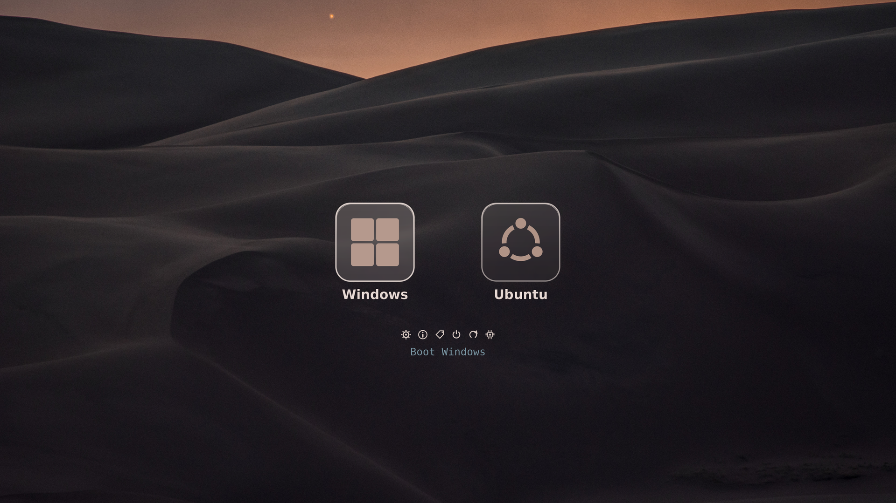
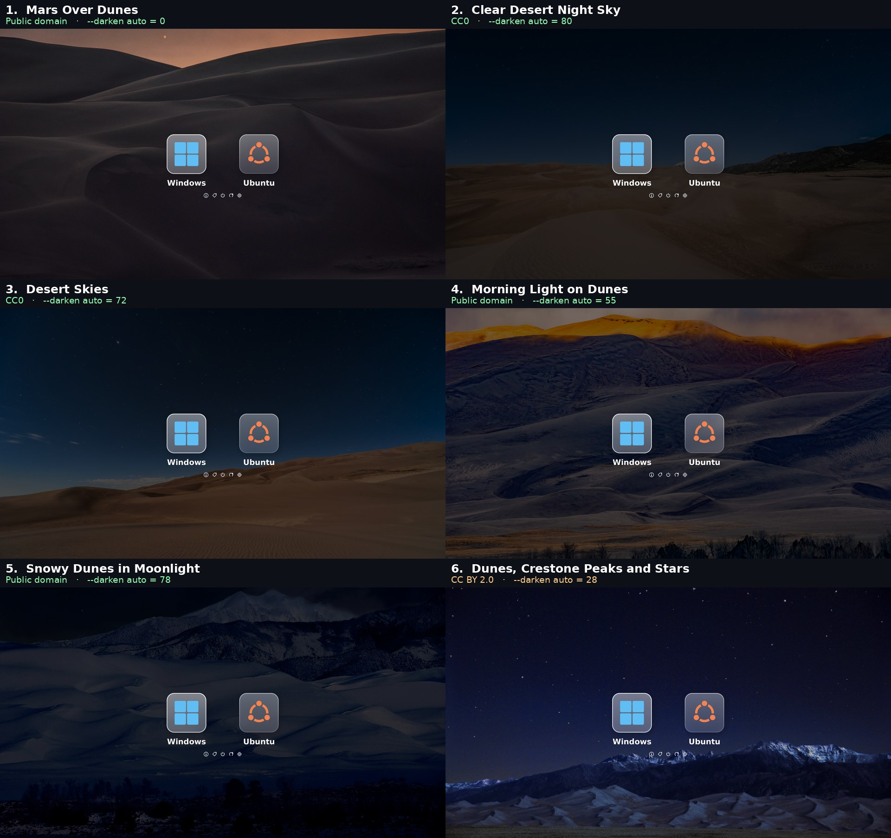

# refind-frosted — a 4K boot menu

A theme for [rEFInd](https://www.rodsbooks.com/refind/) built for **3840×2160**,
which is the whole reason it exists: at that resolution GRUB's software renderer
falls apart, and every asset here is drawn at native size so nothing is ever
scaled up.

Frosted-glass tiles, labels, icons and the bitmap font are all generated by a
script from a single background photograph, at 4K, so the look can be rebuilt
around any photo you like without losing sharpness.

Built for a Windows 11 / Ubuntu dual boot; the two menu entries are ordinary
rEFInd stanzas and can point anywhere.



> **[USAGE.md](USAGE.md)** — how to change the background, use your own photo,
> and adjust the dimming.

> The images in this README are **renders**, not photographs: they are produced by
> `build.py` from the exact same asset files and rEFInd's own layout arithmetic, so
> they are pixel-faithful to what the firmware draws. Photographing a boot screen
> gives a worse picture than the maths does.

---

## Why not GRUB

This theme started as a GRUB theme and had to be abandoned. The reason is
worth recording, because it is not obvious.

GRUB's `gfxmenu` is **entirely software-rendered**. Every repaint is written by
the CPU into the firmware's framebuffer across the PCIe bus, with no
acceleration. At 3840×2160 that is 8.3 million pixels — 31.6 MB — per full
repaint, four times the cost of 1080p.

The visible symptom was not just sluggishness. While GRUB is busy repainting it
is **not reading the keyboard**, so the firmware's key auto-repeat keeps firing
and the events queue up. One press of the arrow key moved the selection *two*
entries. Lowering the resolution fixed it, which is what proved the cause.

rEFInd does not have this problem because of a single architectural difference,
visible in `refind/menu.c`:

```c
static VOID DrawMainMenuEntry(REFIT_MENU_ENTRY *Entry, BOOLEAN selected,
                              UINTN XPos, UINTN YPos) {
    Background = egCropImage(GlobalConfig.ScreenBackground, XPos, YPos, ...);
```

On a selection change it crops and repaints **only the affected tile**, not the
screen, so the cost of moving the selection does not grow with the screen area.

---

## It adapts

`scanfor internal,external,optical,manual` — rEFInd discovers what is actually
attached, every boot. Plug in a bootable USB stick and it appears. Install
another system next year and it appears. Nothing here needs editing.


Two things make that work.

**The glass is blurred by rEFInd itself, at draw time.** A panel painted into
an icon cannot blur what is behind it — the icon is generated long before anyone
knows where it will be drawn. But rEFInd already crops the background to the
exact tile before painting an entry:

```c
Background = egCropImage(GlobalConfig.ScreenBackground, XPos, YPos, W, H);
```

so the blur belongs there. `patches/frosted-glass.patch` adds `egFrostImage()`,
which blurs that crop wherever a stencil says there is glass, and the tokens
`frost_radius` and `frost_mask_big` to control it. `./build-refind.sh --install`
builds and installs it. Without the patched binary the theme still works; the
plates are simply translucent rather than frosted.

The stencil matters more than it sounds. Blending the blur in proportion to the
*panel's* alpha is the obvious thing to do and it is wrong: the panel is 25%
opaque, so the background comes out a quarter blurred and three quarters sharp,
which reads as a slightly soft photograph and not as glass at all. Real frosted
glass scatters everything that passes through it — behind the pane the view is
*fully* blurred, and the pane's tint is laid over that afterwards. So the
stencil's alpha says **where** the glass is, never how transparent it is, and
the tint arrives with the icon that is composited next. Measured on a
detailed photograph, `detail` inside the panel falls from 8.53 to 1.86 while
one pixel outside it stays at 7.97, unchanged.

**The plate is inside the icon, not in the background.** rEFInd re-centres the
row whenever the count changes — with two entries it starts at x=1299, with
three at x=986 — so anything painted into the background at a fixed position
would be stranded the moment a stick is plugged in. Carrying the frosted panel
inside each icon makes the theme correct at any count and any position.

**All 47 of rEFInd's stock OS icons are themed, each with its name baked in.**
rEFInd matches an icon by operating system, so a Fedora install picks up
`os_fedora.png` on its own — and because `build.py` has already composited that
icon onto the plate and written *Fedora* underneath it, a system discovered
years from now arrives looking like it belongs.

Anything rEFInd cannot identify gets `os_unknown.png`, which carries no name —
the line at the bottom of the screen names it instead, from whatever the
firmware reports.

### What it cannot do

**The boot menu is English only, so far.** rEFInd's own strings are compiled
into the binary — `L"Shut Down Computer"`, `L"Reboot Computer"` — with no locale
files and no gettext, so no configuration reaches them. Since the build is
already patched and rebuilt here, translating them is more of the same patch
rather than a different kind of problem; it simply is not done yet. The
graphical picker is translated.

**Discovered systems are slightly softer than the hand-drawn ones.** rEFInd's
stock icons are 128px and get scaled up to 218. Windows and Ubuntu are drawn as
vectors and stay sharp. Dropping a larger PNG into `stock-icons/` and rebuilding
fixes any of them.

---

## Design notes

**The screenshots are rendered by the layout code itself.** `make-screenshots.py`
calls the same `preview()` that `build.py` uses, which walks rEFInd's own
arithmetic for the row positions and runs the same blur the patched binary runs
at draw time. A screenshot in this README therefore cannot drift away from what
the machine draws.

**Names are baked into the icons.** rEFInd's own label mechanism prints one line
at the bottom of the screen in the fixed form *"Boot X from Y"* (see *Gotchas*),
which is useful for identifying a stick but too long to sit under a tile. Baking
the name into the icon gives each entry a short label that travels with it.

**Nothing hand-drawn is ever upscaled.** Every asset is drawn larger than it is used and let
rEFInd shrink it. Downscaling stays sharp; upscaling does not.

---

## Geometry

Every number below is derived, not chosen. `build.py` recomputes them and
**asserts** the spacing is symmetric before it writes a single file.

| Quantity | Formula (`refind/menu.c`) | Value |
|---|---|---|
| `TileSizes[0]` | `big_icon_size * 9 / 8` | 617 |
| `TileSizes[1]` | `small_icon_size * 4 / 3` | 64 |
| `row0PosY` | `UGAHeight/2 - TileSizes[0]/2` | 772 |
| `row0PosX` | `(W + 8 - (TileSizes[0]+8)*2) / 2` | 1299 |
| `row1PosY` | `row0PosY + TileSizes[0] + 16` | 1405 |
| `textPosY` | `row1PosY + TileSizes[1] + 16` | 1485 |
| Tile centres | — | 1607, 2232 |

`big_icon_size = 549` is **not an aesthetic choice**. The OS row is always
centred vertically and the tool row hangs off it, so the only way to place the
tool row *below* the baked labels — instead of on top of them — is to inflate the
OS tile. 549 is the value that yields exactly **52 px above and 52 px below** the
labels. The logos stay 218 px because they are drawn inside mostly-transparent
1098 px canvases: the tile is a bounding box, not the artwork.

Two hard limits constrain it:

- `MaxVisible = UGAWidth / (TileSizes[0] + 8) - 1` must stay ≥ 2, otherwise
  rEFInd shows one OS icon at a time with scrolling. That caps
  `big_icon_size` at 1130.
- `TILE_XSPACING` is `#define`d to 8 px. Tiles always touch; visual separation
  has to come from transparent margins inside the artwork.

---

## Requirements

- rEFInd **0.14.x** (`apt install refind`)
- Python 3 with Pillow (`python3-pil`) — only to regenerate assets
- A display running at 3840×2160 in firmware (check with `videoinfo` at the
  rEFInd shell if unsure)
- **Secure Boot disabled**, unless you sign rEFInd yourself
- DejaVu fonts (`fonts-dejavu-core`) for regeneration

---

## Install

```bash
git clone <this repo> && cd refind-frosted
sudo ./install.sh
```

`install.sh` backs up your current `refind.conf` and drops the assets into
`/boot/efi/EFI/refind/`. It refuses to run if rEFInd is not installed there.

Edit the two `menuentry` blocks in `refind.conf` to match your own loader paths
before installing.

---

## Choosing a background

### The graphical way

```bash
./background-gui.py
```

A GTK4 / libadwaita window: every option as a thumbnail already composited into
the theme, a **+** button to bring in a photo of your own, a switch for automatic
dimming and a slider for manual, and *Preview* / *Apply*. Applying asks for the
password once, through polkit.

`./install-launcher.sh` puts it in the applications menu, so it is one click
away and no terminal is ever needed.


*Shown in Italian, because that is the language of the machine it was taken on —
the interface follows whatever the system is set to.*

The interface follows the system language through gettext. English and Italian
are included; adding another means copying `po/it.po` and translating its 21
strings, then `msgfmt -o locale/<lang>/LC_MESSAGES/refind-background.mo`.

### The command line way

```bash
./background.py                     # browse the library and pick one
./background.py 3                   # or go straight to entry 3
./background.py desert-skies        # or by name
./background.py ~/holiday.jpg       # or any photo of your own
```

Without arguments it prints the library, opens a contact sheet showing every
option already composited into the theme, asks which one you want, renders a
full-screen preview, and installs only after you confirm.

Your own photos: drop them into `library/custom/` and they appear in the list.
Any size or aspect ratio works — they are centre-cropped to 16:9 and scaled to
3840×2160.



### Darkening

The frosted tiles and the white labels need a reasonably dark backdrop, so the
background is dimmed before they are composited onto it.

```bash
./background.py 3                   # default: auto
./background.py --darken 0 3        # leave the photo exactly as shot
./background.py --darken 45 3       # dim it by 45%
./background.py --darken 100 3      # black
```

**`auto` is the default.** It measures the mean luminance of the strip the tiles
sit on and dims until it reaches **30**, which is where the photograph this
theme was first built around happened to sit. Below 5% it does nothing, since a few percent is not worth
applying. Change the default in `library/library.json` (`darken_predefinito`).

`--list` shows what each library photo measures and what `auto` would choose:

| Background | Licence | Luminance | `auto` |
|---|---|---|---|
| Mars Over Dunes | Public domain | 31 | 0 |
| Dunes, Crestone Peaks and Stars | CC BY 2.0 | 42 | 28 |
| Morning Light on Dunes | Public domain | 67 | 55 |
| Desert Skies | CC0 | 107 | 72 |
| Snowy Dunes in Moonlight | Public domain | 136 | 78 |
| Clear Desert Night Sky | CC0 | 154 | 80 |

---

## Customising

All constants live at the top of `build.py`:

```python
BIG, SMALL = 549, 48       # big_icon_size / small_icon_size in refind.conf
FROST      = 32            # frost_radius; the preview renders the same blur
PLATE      = 340           # the glass panel inside an icon
LOGO       = 218           # the OS logo on the panel
TARGET_LUM = 30.0          # what --darken auto aims for
```

Change one, run `./build.py`, and every asset plus the preview render is
rebuilt. If the spacing no longer works out, the script stops with an assertion
rather than producing something subtly wrong.

**`BIG` and `SMALL` must match `big_icon_size` and `small_icon_size` in
`refind.conf`,** and `FROST` must match `frost_radius`: the first pair decides
what gets upscaled, and the second is what makes the preview honest. `PLATE`
drives both the icons and `frost_big.png`, so the stencil cannot fall out of
register with the panel it is a stencil of.

---

## Gotchas

Everything here was found by reading rEFInd's source after the obvious
explanation turned out to be wrong.

**1. The font is inverted on dark backgrounds.** `libeg/text.c`:

```c
if (BGBrightness < 128) {
   LightFontImage->PixelData[i].r = 255 - LightFontImage->PixelData[i].r;
```

rEFInd expects **black** glyphs and inverts them itself. Supply white glyphs and
you get black, unreadable text. `build.py` draws them at 95 so they render at 160
— a soft grey.

**2. A discovered entry is labelled with its own path.** `scan.c`, in
`AddLoaderEntry()`:

```c
Entry->Title = StrDuplicate((LoaderTitle != NULL) ? LoaderTitle : LoaderPath);
```

An automatically discovered loader arrives with no title, so it is named after
the file it is: *"Boot EFI\ubuntu\grubx64.efi from &lt;volume&gt;"*. rEFInd
already knows better than that — `SetLoaderDefaults()` takes
`FindLastDirName(LoaderPath)` as its first icon hint, which is exactly why that
entry gets the Ubuntu logo. The patch reads the same hint for the label, so the
menu names systems rather than files, and drops the *"from &lt;volume&gt;"*
suffix when the loader is on the ESP rEFInd itself booted from — where it is on
every entry and tells none of them apart. A USB stick keeps its suffix, which is
the one case where it says something.

Renaming the ESP's GPT partition is *not* the fix, however tempting: it writes
one machine's name into the partition table and every other machine that ever
sees the disk reads it.

**3. `hideui label` also hides the countdown.** Both live behind the same guard,
so hiding the long titles also removes *"Booting in N seconds"*. Raise `timeout`
to compensate.

**4. The fallback boot loader comes back as a third entry.** `EFI\BOOT\bootx64.efi`
is usually a byte-for-byte copy of `shimx64.efi`, and `shimx64.efi` is in
rEFInd's default `dont_scan_files`. `ScanLoaderDir()` skips it — and skips it
*before* reaching its own `DuplicatesFallback()` test, which only ever sees files
that were accepted:

```c
FilenameIn(Volume, Path, DirEntry->FileName, GlobalConfig.DontScanFiles) ||
!IsValidLoader(Volume->RootDir, FullName)) {
      continue;   // skip this
}
```

So rEFInd refuses to list a program and then offers a byte-identical copy of it
as *"Fallback boot loader"*. The patch runs the duplicate test where the refusal
happens. A USB stick, whose `EFI/BOOT/bootx64.efi` has no twin beside it, is
unaffected — which is the point, since that is how a bootable stick boots.

**5. MokManager is offered with Secure Boot switched off.** rEFInd shows the MOK
utility whenever it finds `mmx64.efi` on the ESP, and Ubuntu's shim always
installs one. But MokManager enrols keys into the database Shim consults, and
Shim consults it only under Secure Boot — so with Secure Boot off the key icon
in the tool row leads nowhere. The patch makes the tool conditional on
`secure_mode()`, so it appears exactly when it can do something.

**6. Icons are upscaled without warning.** `big_icon_size 256` against a 128 px
icon file silently doubles it and it looks soft. Always ship art at or above the
configured size.

**7. On Ubuntu, `recordfail` overrides `GRUB_TIMEOUT`.** If GRUB is chainloaded as
a silent pass-through, an interrupted boot leaves `recordfail=1` in `grubenv`
and `/etc/grub.d/00_header` then forces a 30-second visible menu. Set
`GRUB_RECORDFAIL_TIMEOUT=0`.

**8. Config paths have two different bases.** `banner`, `font` and `selection_*`
are relative to the directory holding `refind_x64.efi`; `icon` inside a
`menuentry` is absolute from the ESP root. Mixing them up fails **silently** —
the file is simply never loaded.

---

## Uninstall

```bash
sudo cp /boot/efi/EFI/refind/refind.conf.bak-* /boot/efi/EFI/refind/refind.conf
```

To remove rEFInd entirely and return to GRUB:

```bash
sudo efibootmgr -o <ubuntu>,<windows>   # reorder, see efibootmgr -v
sudo apt purge refind
```

---

## Credits & licensing

- [rEFInd](https://www.rodsbooks.com/refind/) by Roderick W. Smith — GPLv3
- Every photograph in `library/` is **CC0, public domain, or CC BY**, sourced
  from Wikimedia Commons. Each entry in `library/library.json` records its
  licence, author and origin URL. Only *Dunes, Crestone Peaks and Stars*
  (CC BY 2.0) requires attribution if you redistribute it.
- Icons, font, frosted glass and layout are generated by `build.py` — no
  third-party artwork is involved.

This theme began as a port of the Mojave look from
[Elegant-grub2-themes](https://github.com/vinceliuice/Elegant-grub2-themes),
whose background is Apple's copyrighted wallpaper. That photograph is **not**
in this repository and is not used by it.
