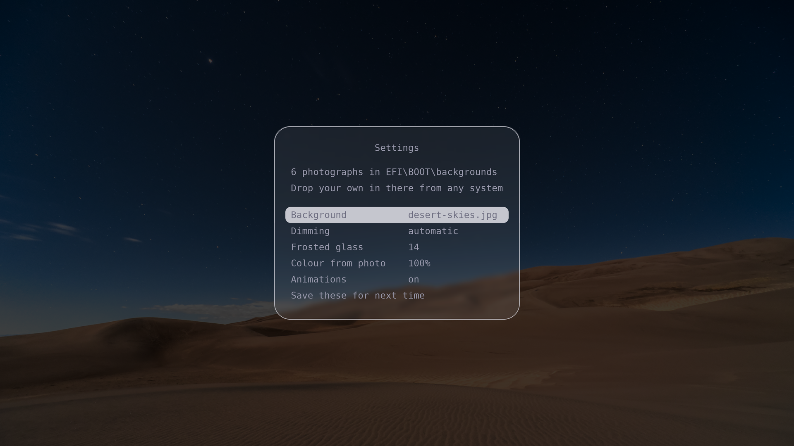
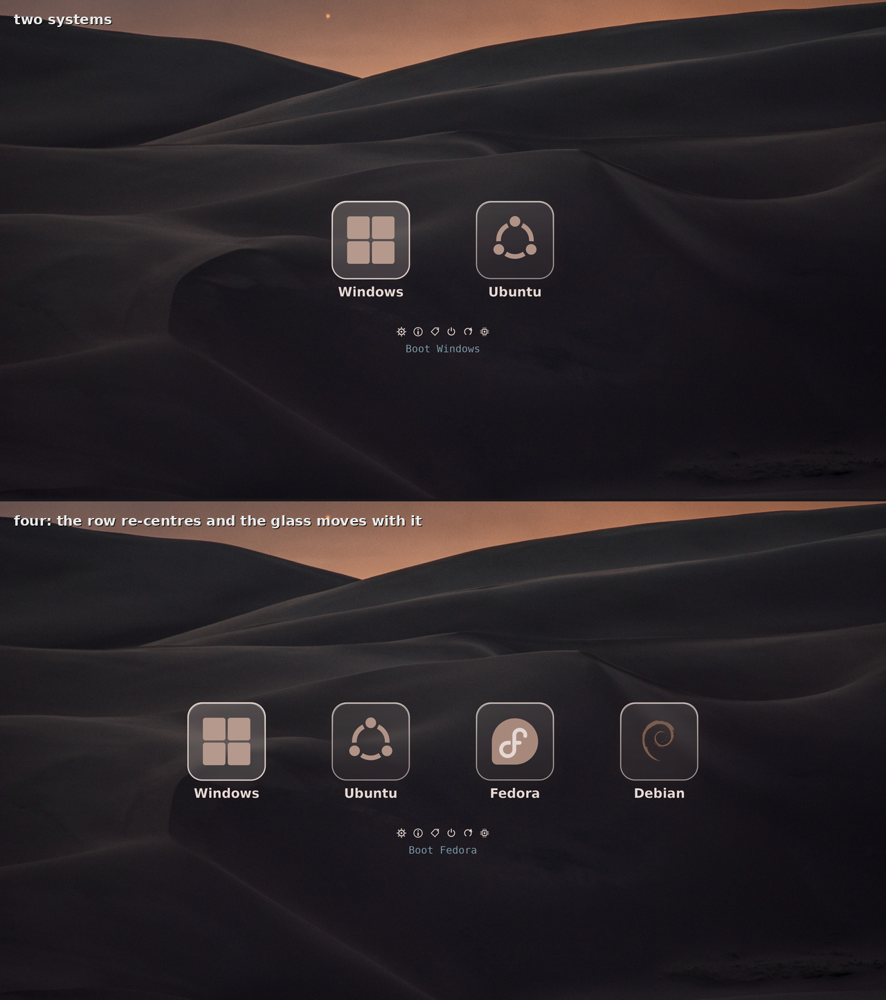
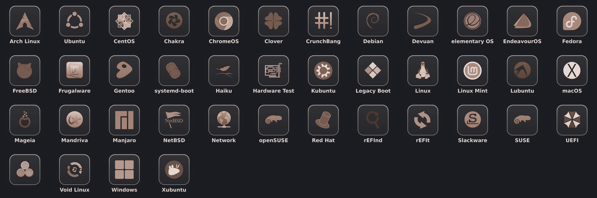
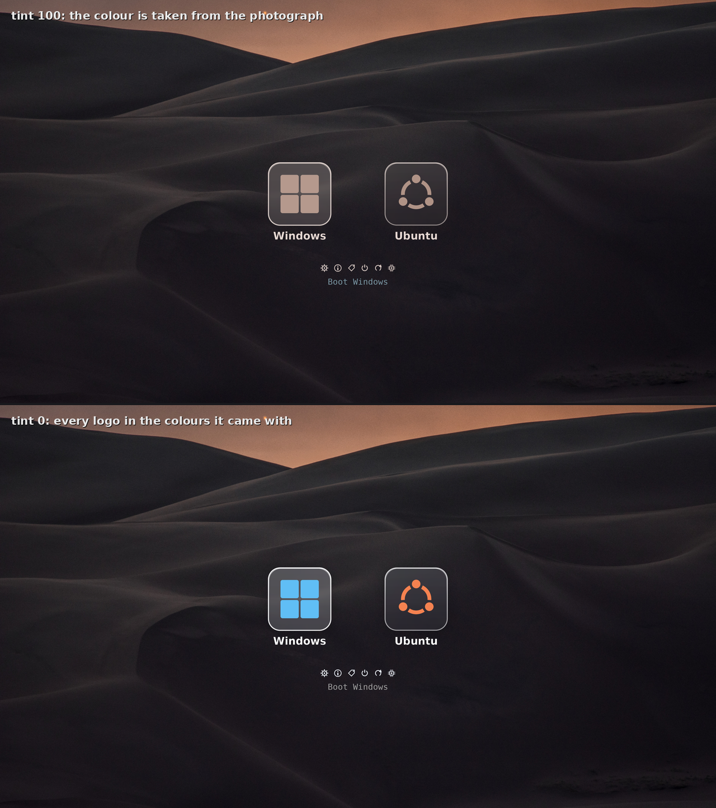
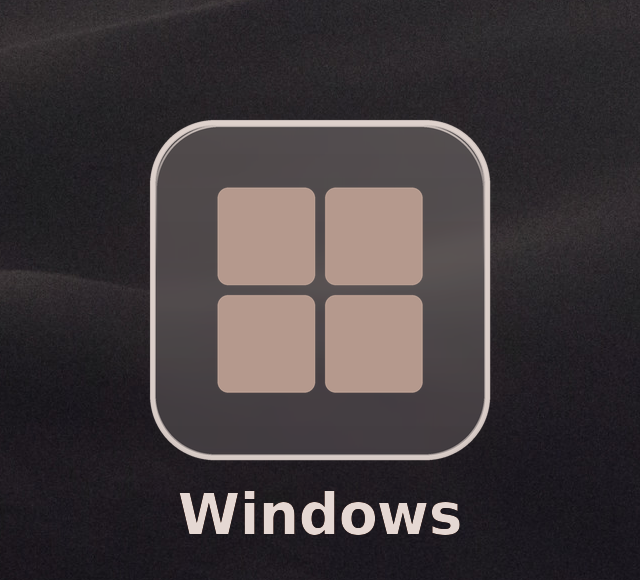
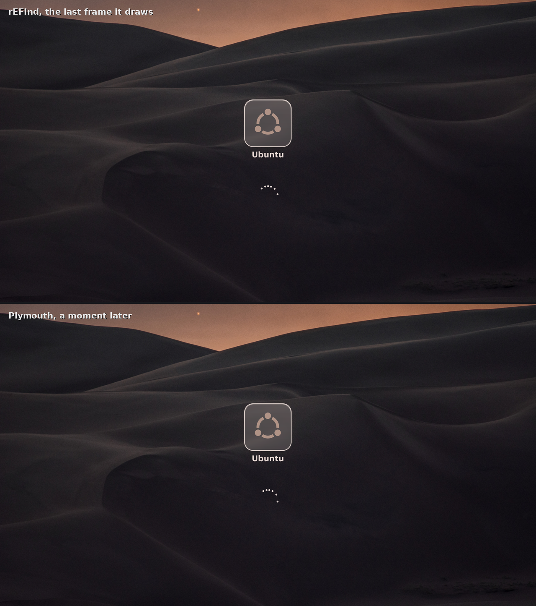

# refind-frosted

A boot menu for [rEFInd](https://www.rodsbooks.com/refind/), drawn at 3840×2160
and rendered at whatever your screen turns out to be. Frosted glass, one
photograph, and every system on the machine picked up by itself.


The artwork is generated. Point it at a photograph and it works out the colours,
redraws the tiles, the logos, the labels and the bitmap font, and fits them to
whatever size your screen turns out to be. There is no per-machine
configuration: Windows, Linux, a USB stick, a system you install next year.
rEFInd finds them and each one gets its own logo and the same glass.

## Install

```bash
git clone https://github.com/IDanK0/refind-frosted && cd refind-frosted
sudo ./setup.sh
```

It prints everything it is about to do and waits for you to say yes. It writes
into a directory of its own, so no other bootloader is touched, and it asks the
firmware to try the new menu once instead of taking over the boot order. If the
next boot is not what you wanted, do nothing and the one after it is unchanged.

`sudo ./setup.sh --uninstall` puts it all back.

## What you get

The settings screen is inside the boot menu, so the photograph and the dimming
can be changed with no operating system running.



Plug in a USB stick and rEFInd re-centres the row. The glass travels with each
entry, because the panel lives inside the icon and not in the background.



Forty distinct logos, all themed to match. rEFInd knows forty-seven names and
several of them share a logo, which is why the sheet is shorter than the list.
Thirty are rasterised from vector sources at 549 px. The other seventeen have no
vector anywhere and are still rEFInd's 128-pixel bitmaps; `stock-icons/SOURCES.md`
names them.



The colour is taken from the photograph. `tint 0` puts every logo back to the
colours it came with.



The glass is blurred by rEFInd itself while it draws, so the panel shows what is
actually behind it at the position it ended up in. Here it is at 1:1.



Six photographs ship with it, and the theme reads each one's own colour.


## Things that move

The menu arrives one tile at a time, each rising into place as it appears.


*Half speed. About three quarters of a second on the machine.*

Choose a system and the rest of the menu fades out while the tile you picked
travels to the middle, where a ring of dots turns under it until the handover.


*Half speed.*


*True speed: one turn is 1.8 seconds.*

All of it stops the instant a keystroke is waiting, so holding an arrow key is
as fast as it ever was, and `animations false` turns it off.

## The splash carries on

Ubuntu's spinner is replaced by the same photograph and the same tile, holding
the logo and name of the system that is starting.



The top half is the boot menu, the bottom half Plymouth a moment later. Both put
the tile at y=613 and the ring at y=1401, worked out the same way from the same
photograph, so the handover has nothing to move.

The boot menu can change its photograph at any time from its own settings
screen, with no operating system running, and the splash lives in an initramfs
built weeks earlier. So a service asks: once per boot it compares the two and
rebuilds the splash if they have drifted apart.

## And Windows

Windows does not choose the picture it shows while it starts. It reads one out
of an ACPI table that the firmware fills in with the manufacturer's logo, which
is why a laptop shows its own badge during a Windows boot. A bootloader is the
last thing to run before the operating system, so it is the last thing that can
write to that table.


That image was read back off `/sys/firmware/acpi/bgrt/image` on a running
machine, which is where the picture ends up. It puts nothing inside Windows, so
reinstalling Windows leaves it alone.

## Requirements

A machine that boots through UEFI, on x86-64, with Secure Boot off.

Secure Boot is not a preference. The boot menu is rEFInd with a patch, built on
your machine, and nothing signs it; with Secure Boot on the firmware refuses to
start it. The installer checks, says so, and stops. It also prints the three
ways round it: turn Secure Boot off, enrol the binary's hash with `mokutil
--import-hash`, or sign it yourself with `sbctl`.

Everything else the installer can find out for itself, and will install for you:

```bash
sudo ./setup.sh --install-deps
```

Or by hand:

| | |
|---|---|
| Debian, Ubuntu, Mint, Pop!_OS | `build-essential gnu-efi patch curl python3-pil fonts-dejavu-core efibootmgr plymouth` |
| Fedora | `gcc make binutils patch curl gnu-efi gnu-efi-devel python3-pillow dejavu-sans-fonts efibootmgr plymouth plymouth-plugin-script` |
| RHEL, Rocky, Alma 9 | the Fedora list plus `gnu-efi-compat`. `gnu-efi` is in AppStream; `gnu-efi-devel` and `gnu-efi-compat` are in CRB |
| openSUSE | `gcc make binutils gnu-efi-devel python3-Pillow dejavu-fonts efibootmgr plymouth plymouth-plugin-script` |
| Arch, Manjaro, EndeavourOS | `base-devel gnu-efi python-pillow ttf-dejavu efibootmgr plymouth` |
| Void | `base-devel gnu-efi-libs patch curl python3-Pillow dejavu-fonts-ttf efibootmgr plymouth` |
| Alpine | `build-base gnu-efi-dev patch curl py3-pillow font-dejavu efibootmgr plymouth` |

It builds against gnu-efi 3.x and 4.x both. The two generations disagree about
who provides `AsciiStrLen`, which is enough to fail the link on one of them, so
the patch asks the header at compile time.

Your screen does not have to be 4K. Every measurement is a fraction of screen
height, and the artwork is rendered at whatever resolution the machine reports,
so a 1080p laptop gets a 1080p theme.

## What the installer does

**1. It looks at the machine.**

```
Looking at this machine
  + architecture   x86_64
  + firmware       64-bit UEFI
  + Secure Boot    off
  + EFI partition  /boot/efi  (/dev/nvme0n1p1)
                 139 MB free
  + distribution   Ubuntu 26.04 LTS  (apt)
  + initramfs      initramfs-tools
  + plymouth       installed
                 /boot has 209662 MB free
  + screen         3840x2160
  + dependencies   all present
```

It stops here, having changed nothing, if any of that is wrong: no UEFI, 32-bit
firmware, Secure Boot on, no EFI partition, more than one EFI partition (it
lists them so you can name one with `--esp`), or a missing dependency.

**2. It prints the plan.** Every path it will write, every backup it will keep,
and what it will ask the firmware for. `--dry-run` stops here for good.

**3. It asks.** `--yes` skips the question.

**4. It writes a rescue card first,** to `RESCUE.TXT` on the EFI partition,
before anything is at risk. Plain text with CRLF and an 8.3 name, so a firmware
shell, a Windows machine or a live USB can all read it. It says how to undo
everything by hand.

**5. It installs the boot menu.** Builds rEFInd 0.14.2 with the patch, after
checking the downloaded tarball against a recorded SHA-256, renders the artwork
at your screen's resolution, and writes it into a directory of its own. Anything
already at a path it writes is kept as `*.before-refind-frosted`.

**6. It asks the firmware for a new entry and tries it once.** `BootNext`, not
the boot order. The next boot goes to the new menu; the one after that boots the
way your machine boots today. When you are happy with it:

```bash
sudo ./setup.sh --promote
```

**7. It installs the splash,** separately. If that fails the boot menu you just
installed is untouched and every initramfs is restored from the copy it kept. It
refuses to start at all if `/boot` has less room than the rebuild needs.

### If something goes wrong

Nothing that was there before was replaced, so every other boot entry still
works. Pick one from the firmware's own boot menu, usually F12, F11, Esc or
Option at power-on, and the machine starts as it always did.

```bash
sudo ./setup.sh --status          # what is installed
sudo ./setup.sh --uninstall       # put everything back
```

Every write is recorded in `/var/lib/refind-frosted/journal` before it happens
and flushed to disk, so `--uninstall` works even if the installer was killed
halfway through. It replays that journal backwards: files it wrote are removed,
files it replaced are restored, the firmware entry is deleted, the boot order
goes back, and Plymouth returns to whichever theme was selected before. Anything
you added yourself is left alone, including photographs you dropped into
`backgrounds/`.

If the journal is gone, `RESCUE.TXT` on the EFI partition lists the same steps
by hand.

### Options

| | |
|---|---|
| `--dry-run` | print the plan and stop |
| `--yes` | do not ask |
| `--install-deps` | install missing packages first |
| `--permanent` | boot order, not just the next boot |
| `--promote` | make an already-installed menu the default |
| `--status` | what is installed |
| `--uninstall` | put everything back |
| `--no-splash`, `--no-menu` | one half only |
| `--esp PATH` | which EFI partition, when there is more than one |
| `--background NAME` | which photograph to start with |

## Changing the photograph

There is a Settings icon in the tool row. It lists every picture in the menu's
own `backgrounds/` directory and writes what you choose to `theme.conf`, which
`refind.conf` includes last. Delete that file and the menu goes back to the
defaults.

Adding a photograph of your own means copying a file onto the EFI partition,
from Linux, Windows, a live USB or the firmware's own file manager. It appears
in the list at the next boot and is themed like the ones that shipped: the
colours are worked out from the picture each time.

From the command line:

```bash
./build.py                          # redraw everything
./build.py --background ~/mine.jpg  # against a photo of yours
./build.py --tint 0                 # with the logos' own colours
./build.py --size 1920x1080         # for a screen that size
sudo ./setup.sh                     # copy it all to the EFI partition
```

[USAGE.md](USAGE.md) covers the settings screen, the configuration tokens and
the test harnesses. [INTERNALS.md](INTERNALS.md) is how it works and why:
the colour arithmetic, the frosted glass, what it costs to draw a 4K menu on a
framebuffer, and a list of the things in rEFInd that had to be read before any
of it made sense.

## Licence

GPLv3, in [LICENSE](LICENSE). It has to be: the boot menu is rEFInd with a patch
applied, and rEFInd is GPLv3.

[NOTICE.md](NOTICE.md) is the full account of what was borrowed. In short:
rEFInd by Roderick W. Smith; six photographs from Wikimedia Commons under CC0,
public domain, CC BY 2.0 and CC BY-SA 4.0, each recorded in
`library/library.json`; logos from rEFInd's own set and from Commons, listed in
`stock-icons/SOURCES.md`; and DejaVu Sans for every glyph.

The CC BY and CC BY-SA photographs ask for credit if you pass them on, and the
share-alike one passes its licence to anything built from it.
